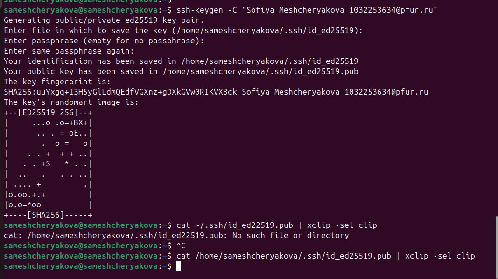
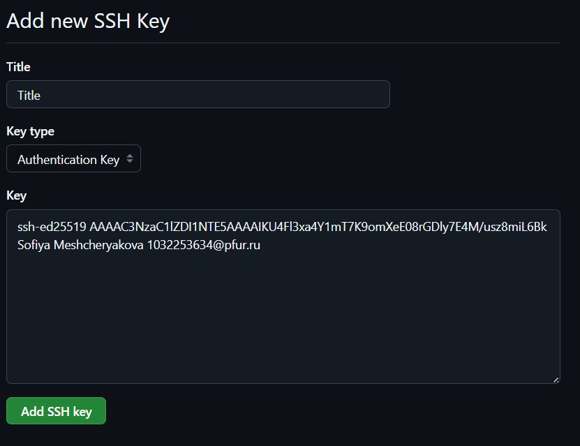
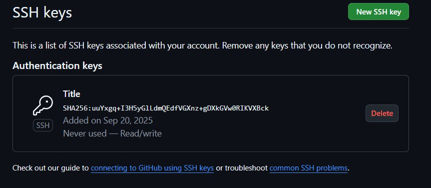
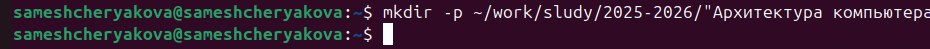
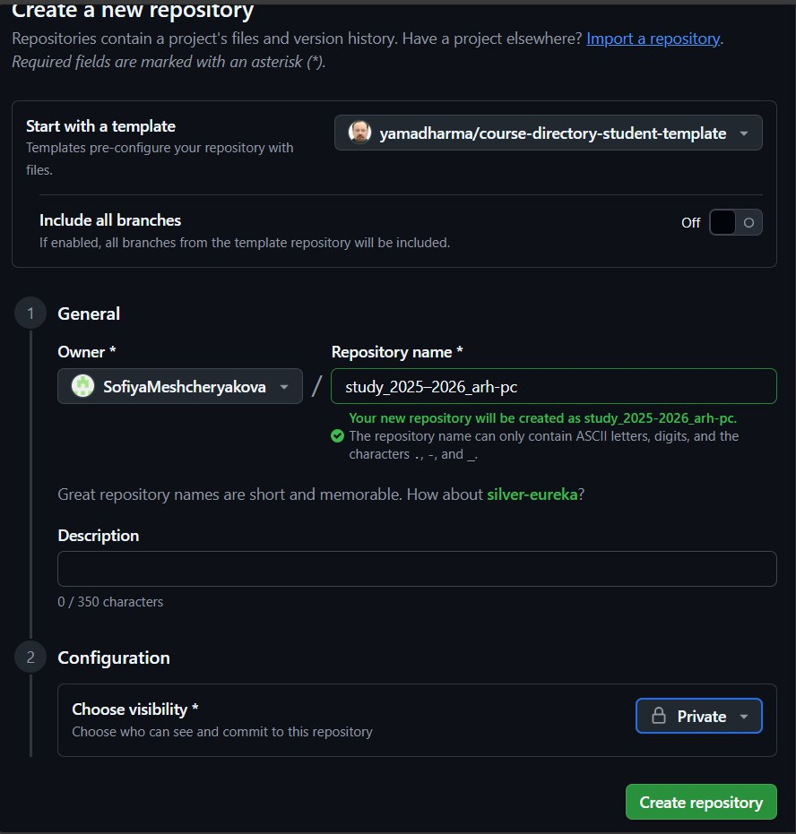
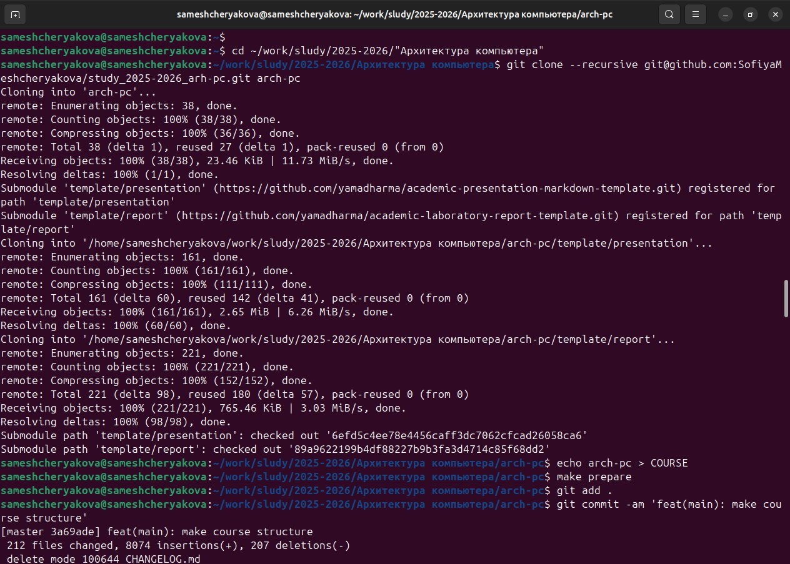
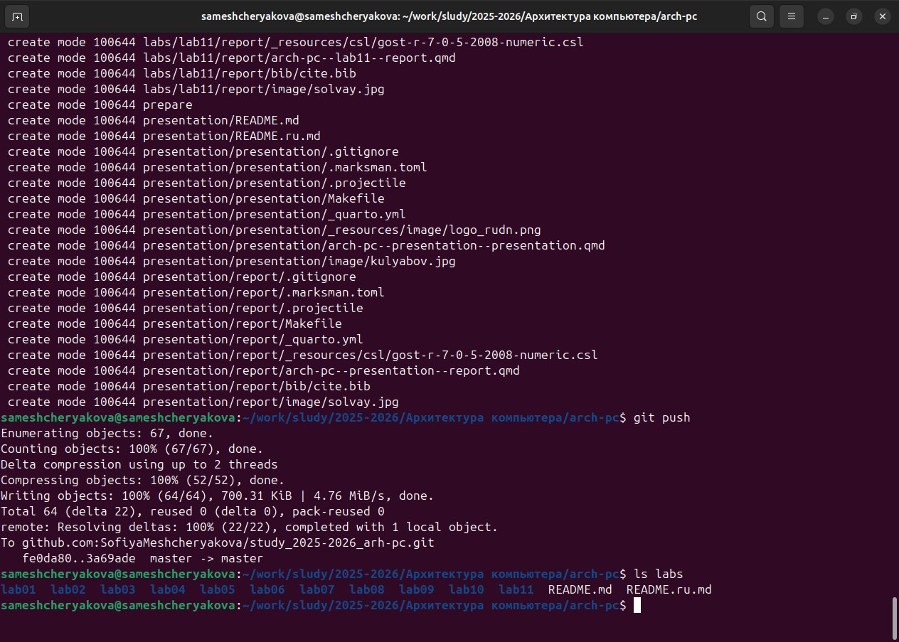
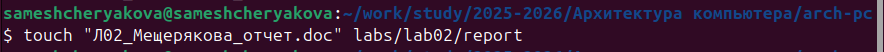
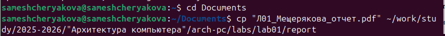
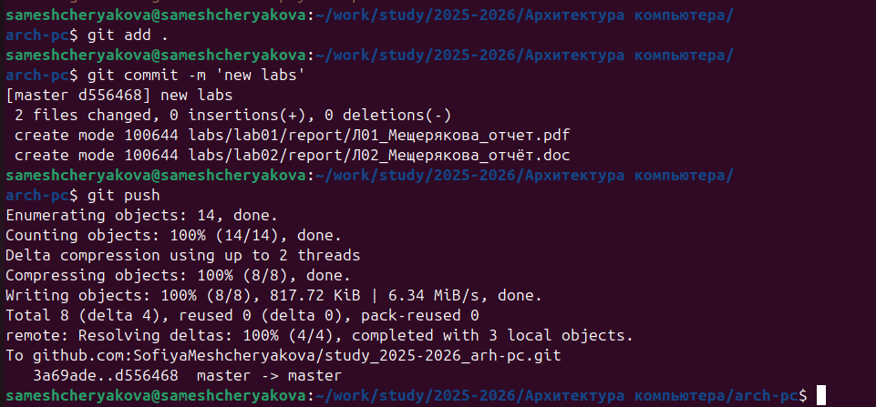

---
## Author
author:
  name: Мещерякова София Андреевна
  affiliation:
    - name: Российский университет дружбы народов
      country: Российская Федерация
      postal-code: 117198
      city: Москва
      address: ул. Миклухо-Маклая, д. 6

## Title
title: "Отчёта по лабораторной работе №2"
subtitle: "Система контроля версий git"
---

# Цель работы

Целью работы является ознакомление с системой контроля версий Git, приобретение практических навыков по работе с данной системой.

# Задание

Создать учетной записи и настроить github  
Создать SSH ключа  
Создать рабочее пространство и репозиторий курса на основе шаблона
Настроить каталог курса
Создать отчёт по лабораторной работе №2 и загрузить его на github

# Выполнение лабораторной работы

Создадим учетную запись на сайте https://github.com/ и заполним основные данные.

Сделаем предварительную конфигурацию git и настроим её (рис. @fig:001).

{#fig:001 width=70%}

Для последующей идентификации пользователя на сервере репозиториев необходимо сгенерируем пару ключей. Чтобы загрузить сгенерированный открытый ключ необходимо скопировать его из локальной консоли в буфер обмена и вставить в появившееся на сайте поле для ключа (рис. @fig:002).

{#fig:002 width=70%}

Заходим в свой аккаунт на сайте github и переходим в настройки. Добавляем скопированный ключ и указываем имя ключа – Title (рис. @fig:003).

{#fig:003 width=70%}

Проверим наличие ключа (рис. @fig:004).

{#fig:004 width=70%}

Откроем терминал. Создадим каталог для предмета «Архитектура компьютера» (рис. @fig:005).

{#fig:005 width=70%}

Перейдем на страницу репозитория с шаблоном курса и создадим репозиторий (рис. @fig:006).

{#fig:006 width=70%}

Переходим в каталог курса, создаем необходимые каталоги и  Отслеживаем файл и записываем изменения в репозиотрий (рис. @fig:007).

{#fig:007 width=70%}

Отправляем данные в репозиторий и проверяем выполнение команд (рис. @fig:008).

{#fig:008 width=70%}

# Задания для самостоятельной работы

Создадим отчёт по выполнению лабораторной работы №2 в соответствующем каталоге labs/lab02/report (рис. @fig:009).

{#fig:009 width=70%}

Скопируем отчеты по выполнению предыдущих лабораторных работ в соответствующие каталоги созданного рабочего пространства (рис. @fig:010).

{#fig:010 width=70%}

Загрузим файлы на github (рис. @fig:011).

{#fig:011 width=70%}

# Выводы

Мы познакомились с системой контроля git, выучили команды для работы с ним. А также создали репозиторий на платформе github, где в последствии будут храниться отчёты по лабораторным работам.

