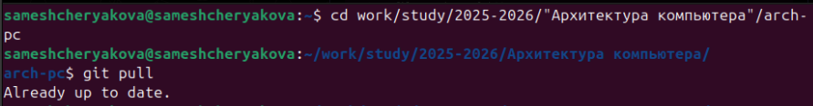
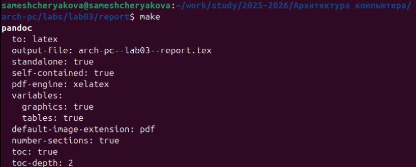
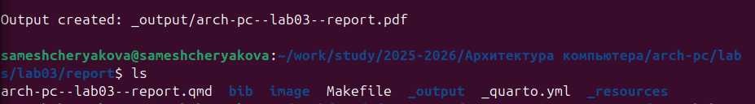
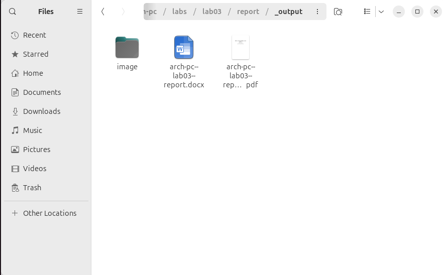
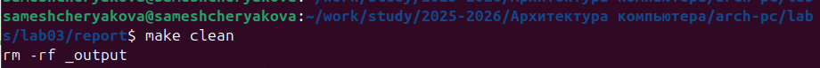
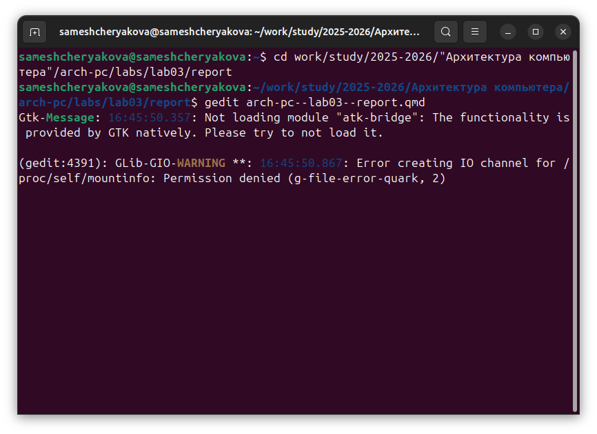

---
## Author
author:
  name: Мещерякова София Андреевна
  affiliation:
    - name: Российский университет дружбы народов
      country: Российская Федерация
      postal-code: 117198
      city: Москва
      address: ул. Миклухо-Маклая, д. 6

## Title
title: "Лабораторная работа №3"
subtitle: "Язык разметки Markdown"
---

# Цель работы

Целью работы является освоение процедуры оформления отчетов с помощью легковесного
языка разметки Markdown.

# Задание

- Задания лабораторной работы
  - Обновить локальный репозиторий
  - Провести компиляцию шаблона с использованием Makefile, затем удалить файлы
  - Заполнить и скомпилировать отчет 
- Задание для самостоятельной работы
  - В соответствующем каталоге сделайте отчёт по лабораторной работе № 2 в формате
  - Markdown.
  - Загрузите файлы на github

# Выполнение лабораторной работы
 
Переходим в каталог курса. С помощью команды git pull обновляем локальный репозиторий (рис. @fig:001).

{#fig:001}

Переходим в каталог labs03, где используем команду make, чтобы создать файлы отчетов (рис. @fig:002).

{#fig:002}

Проверим выполнение команды с помощью команды ls (рис. @fig:003).

{#fig:003}

Был создан каталог _output, который содержит созданные файлы
(рис. @fig:004).

{#fig:004}

Используем команду make clean, которая удаляет созданные документы (рис. @fig:005).

{#fig:005}

Используем команду gedit, которая открывает редактор документа (рис. @fig:006).

{#fig:006}

Изучаем и редактируем открытый файл (рис. @fig:007).

{#fig:007}

# Выводы

Мы познакомились с языком разметки Markdown и оформили отчет в ней и загрузили файлы на Github.

# Список литературы{.unnumbered}

::: {#refs}
:::
