---
## Author
author:
  name: Мещерякова София Андреевна
  affiliation:
    - name: Российский университет дружбы народов
      country: Российская Федерация
      postal-code: 117198
      city: Москва
      address: ул. Миклухо-Маклая, д. 6

## Title
title: "Отчёт по лобораторной работе №6"
subtitle: "Арифметические операции в NASM"
license: "CC BY"
--- 


# Цель работы

Освоение арифметических инструкций языка ассемблера NASM.

# Выполнение лабораторной работы

1. Создадим каталог для программ лабораторной работы № 6, перейдём в него и
создадим файл lab6-1.asm([рис. @fig-001]).

{#fig-001 width=70%}

2. Рассмотрим примеры программ вывода символьных и численных значений. Программы будут выводить значения записанные в регистр eax.

Введем в файл lab6-1.asm текст программы из листинга 6.1 ([рис. @fig-002]).

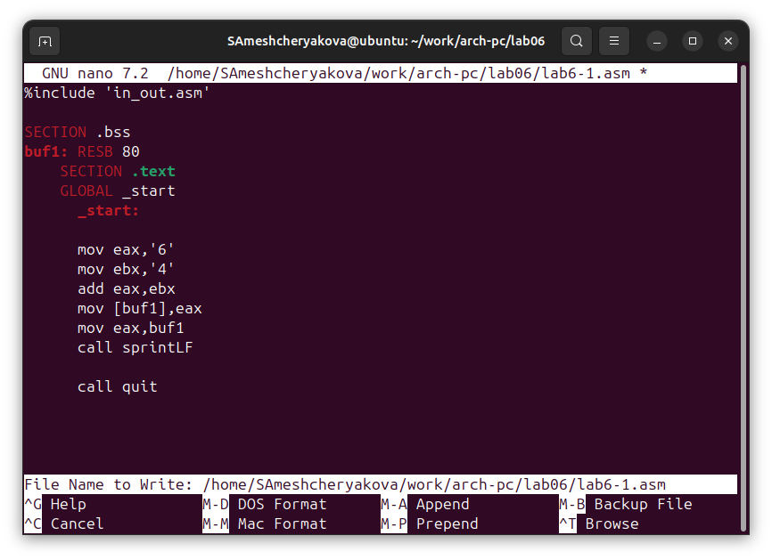{#fig-002 width=70%}

Листинг 6.1

```nasm
%include 'in_out.asm'

SECTION .bss
buf1: RESB 80
    SECTION .text
    GLOBAL _start
      _start:

      mov eax,'6'
      mov ebx,'4'
      add eax, ebx
      mov [buf1], eax
      mov eax, buf1
      call sprintLF

      call quit
```
Создадим исполняемый файл и запустим его ([рис. @fig-003]).

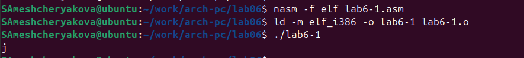{#fig-003 width=70%}

3. Далее изменим текст программы и вместо символов, запишем в регистры числа. Исправим текст программы: заменим строковые значения на числовые ([рис. @fig-004]).

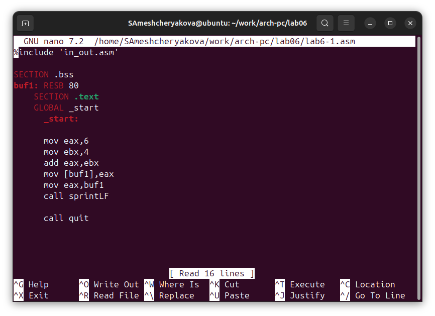{#fig-004 width=70%}

Листинг 6.1 (с изменениями)

```nasm

%include 'in_out.asm'

SECTION .bss
buf1: RESB 80
    SECTION .text
    GLOBAL _start
      _start:

      mov eax,6
      mov ebx,4
      add eax,ebx
      mov [buf1],eax
      mov eax,buf1
      call sprintLF

      call quit
```

Создадим исполняемый файл и запустим его ([рис. @fig-005]).

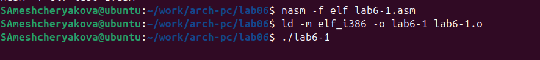{#fig-005 width=70%}

Выводится символ с кодом 10, который не отображается на экране.

4. Создайте файл lab6-2.asm в каталоге ~/work/arch-pc/lab06 
 ([рис. @fig-006]).

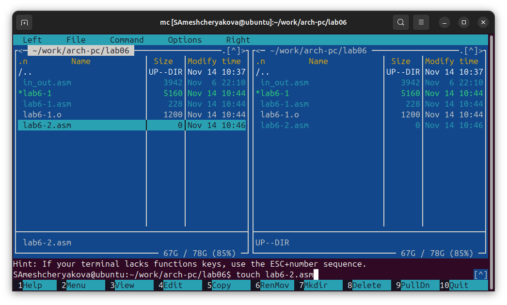{#fig-006 width=70%}

Введем в него текст программы из листинга 6.2 ([рис. @fig-006]).

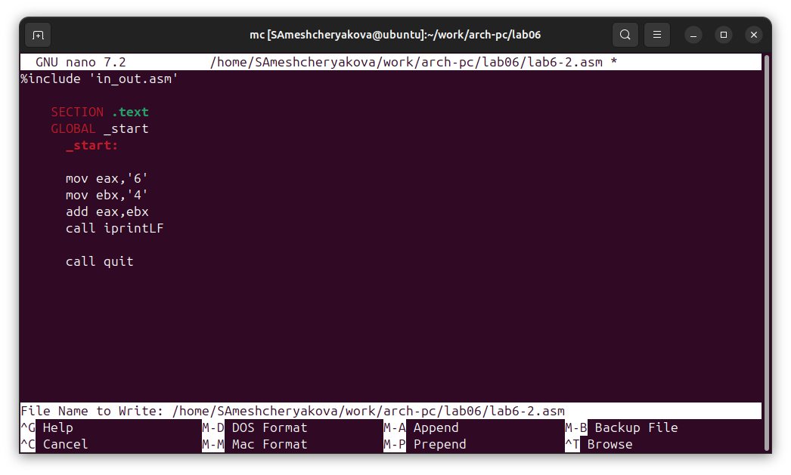{#fig-006 width=70%}

Листинг 6.2

```nasm        
%include 'in_out.asm'

    SECTION .text
    GLOBAL _start
      _start:

      mov eax,'6'
      mov ebx,'4'
      add eax,ebx
      call iprintLF

      call quit
```

Создадим исполняемый файл и запустим его ([рис. @fig-007]).

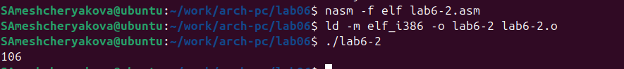{#fig-007 width=70%}

5. Аналогично предыдущему примеру изменим символы на числа. Замените строковые значения на числовые([рис. @fig-008]).

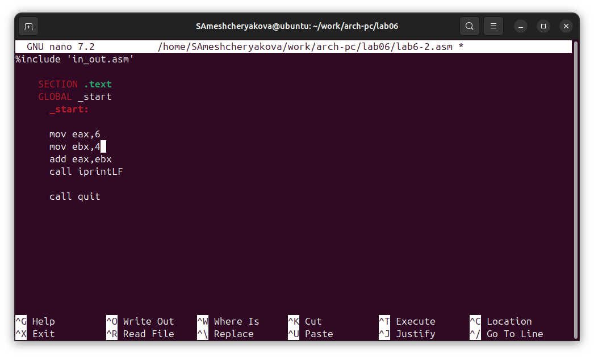{#fig-008 width=70%}

Листинг 6.2 (с изменениями)

```nasm
%include 'in_out.asm'

    SECTION .text
    GLOBAL _start
      _start:

      mov eax,6
      mov ebx,4
      add eax,ebx
      call iprintLF

      call quit
```

Создадим исполняемый файл и запустим его ([рис. @fig-009]).

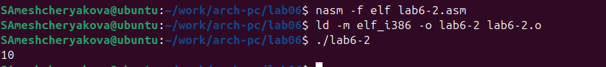{#fig-009 width=70%}

Результат запуска программы - число 10.

Заменим функцию iprintLF на iprint.

Листинг 6.2 (с заменой iprintLF на iprint)

```nasm
%include 'in_out.asm'

    SECTION .text
    GLOBAL _start
      _start:

      mov eax,6
      mov ebx,4
      add eax,ebx
      call iprint

      call quit
```

Создадим исполняемый файл и запустим его ([рис. @fig-010]).

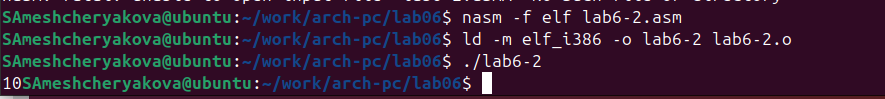{#fig-010 width=70%}

В отличие от iprintLF функция iprint не добавляет символ перевода строки.

6. В качестве примера выполнения арифметических операций в NASM приведем программу вычисления арифметического выражения $f(x) = (5 ∗ 2 + 3)/3$.

Создадим файл lab6-3.asm в каталоге ~/work/arch-pc/lab06 ([рис. @fig-011]).

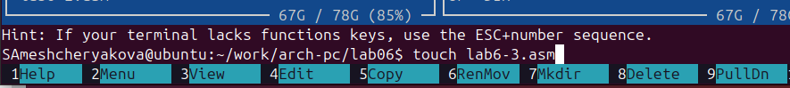{#fig-011 width=70%}

Введем текст программы из Листинга 6.3 ([рис. @fig-012]).

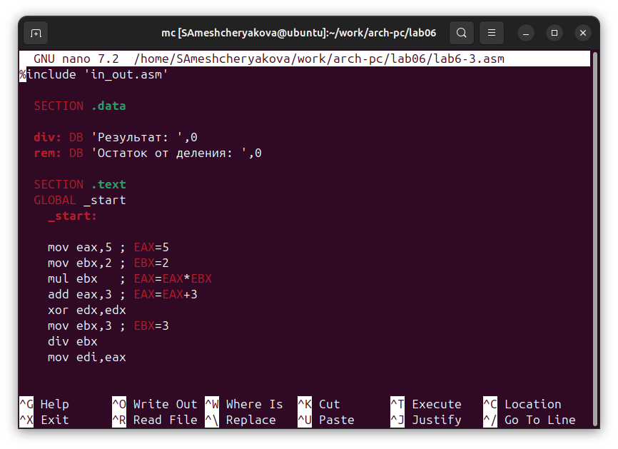{#fig-012 width=70%}

Листинг 6.3

```nasm
%include 'in_out.asm'

  SECTION .data

  div: DB 'Результат: ',0
  rem: DB 'Остаток от деления: ',0

  SECTION .text
  GLOBAL _start
    _start:

    mov eax,5 ; EAX=5
    mov ebx,2 ; EBX=2
    mul ebx   ; EAX=EAX*EBX
    add eax,3 ; EAX=EAX+3
    xor edx,edx
    mov ebx,3 ; EBX=3
    div ebx
    mov edi,eax
```

Создадим исполняемый файл и запустим его ([рис. @fig-013]).

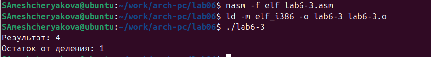{#fig-013 width=70%}

Изменим текст программы для вычисления выражения  $f(𝑥) = (4 ∗ 6 + 2)/5$ ([рис. @fig-014]).

Листинг 6.3 (для $f(𝑥) = (4 ∗ 6 + 2)/5$)

```nasm     
%include 'in_out.asm'

  SECTION .data

  div: DB 'Результат: ',0
  rem: DB 'Остаток от деления: ',0

  SECTION .text
  GLOBAL _start
    _start:

    mov eax,4 ; EAX=4
    mov ebx,6 ; EBX=6
    mul ebx   ; EAX=EAX*EBX
    add eax,2 ; EAX=EAX+2
    xor edx,edx
    mov ebx,5 ; EBX=5
    div ebx
    mov edi,eax

```

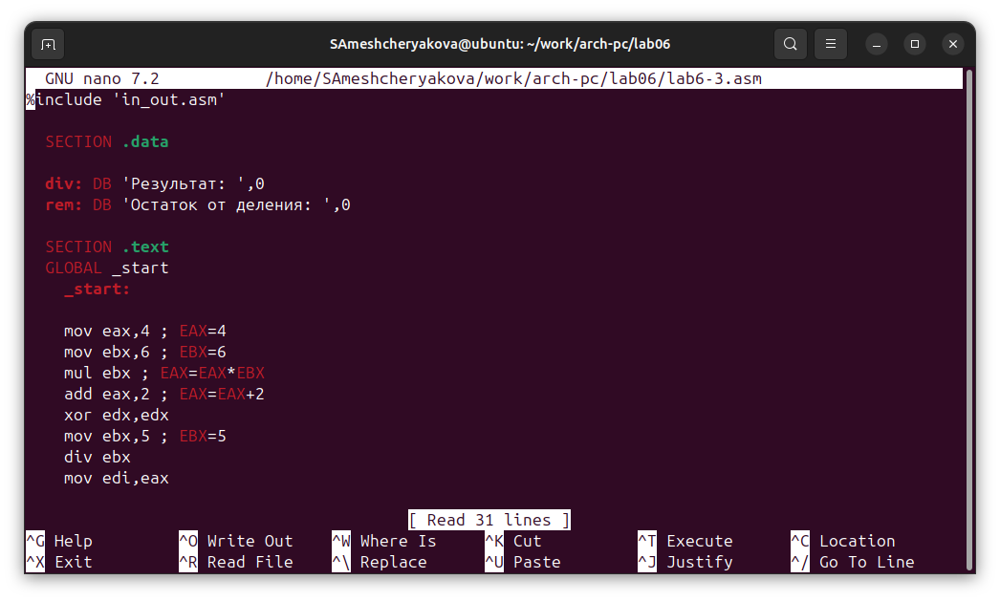{#fig-014 width=70%}

Создайдим исполняемый файл и проверим его работу ([рис. @fig-015]).

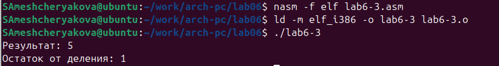{#fig-015 width=70%}

7. В качестве другого примера рассмотрим программу вычисления варианта задания по
номеру студенческого билета, работающую по следующему алгоритму:

- вывести запрос на введение № студенческого билета

- вычислить номер варианта по формуле: $(S_n mod 20) + 1$, где  $S_n$ – номер
cтуденческого билета (В данном случае a mod b – это остаток от деления a на b).

- вывести на экран номер варианта.

Листинг 6.4

```nasm

%include 'in_out.asm'

  SECTION .data
  msg: DB 'Введите № студенческого билета: ',0
  rem: DB 'Ваш вариант: ',0

  SECTION .bss
  x: RESB 80

  SECTION .text
  GLOBAL _start
    _start:

    mov eax, msg
    call sprintLF

    mov ecx, x
    mov edx, 80
    call sread

    mov eax,x
    call atoi
    
    xor edx,edx
    mov ebx,20
    div ebx
    inc edx
    
    mov eax,rem
    call sprint
    mov eax,edx 
    call iprintLF

    call quit
```


Создадим файл variant.asm в каталоге ~/work/arch-pc/lab06 ([рис. @fig-016]).

{#fig-016 width=70%}

Введем в файл текст программы из Листинга 6.4 ([рис. @fig-017]).

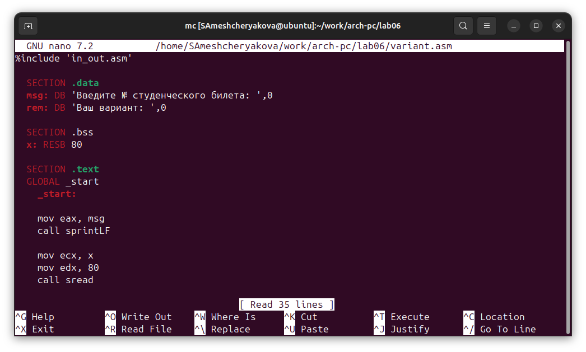{#fig-017 width=70%}

Создадим исполняемый файл и запустим его ([рис. @fig-018]).

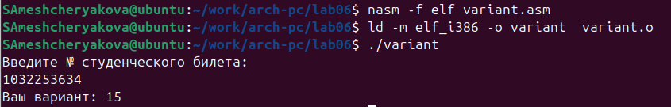{#fig-018 width=70%}

Проверим результат выполнения программы. 

1) 1032253634 mod 20 = 14

2) 14 + 1 = 15 - результат совпадает с полученным в программе.

### Ответы на вопросы по программе из Листинга 6.4

1. Какие строки листинга 6.4 отвечают за вывод на экран сообщения ‘Ваш вариант:’?

За вывод этого сообщения отвечают строки

```nasm
mov eax, rem
call sprint
```

2. Для чего используется следующие инструкции?

```nasm
mov ecx, x    ;1
mov edx, 80   ;2
call sread    ;3
```
1) загружает в регистр ecx адрес буфера x
2) mov edx, 80 — загружает в регистр edx число 80 (максимальное количество байт для считывания)
3) call sread — вызывает функцию sread из in_out.asm, которая считывает строку с клавиатуры, записывает её в буфер по адресу ecx, ограничивает длину edx байтами.

3. Для чего используется инструкция “call atoi”?

Инструкция call atoi вызывает функцию atoi из in_out.asm, которая позволяет преобразовать текстовое представление числа в целое число.

4. Какие строки листинга 6.4 отвечают за вычисления варианта?

За вычисления варианта отвечают строки:

```nasm
xor edx, edx
mov ebx, 20
div ebx
inc edx
```

5. В какой регистр записывается остаток от деления при выполнении инструкции “div
ebx”?

Остаток от деления при выполнении `div ebx` записывается в регистр edx.

6. Для чего используется инструкция “inc edx”?

Инструкция inc edx увеличивает значение регистра edx на 1.

7. Какие строки листинга 6.4 отвечают за вывод на экран результата вычислений?

За вывод на экран результата вычислений отвечают строки:

```nasm
mov eax, edx
call iprintLF
```

# Выполнение заданий для самостоятельной работы

1. Написать программу вычисления выражения $y = f(x)$. Для варианта 15 $f(x) = (5 + x)^2 − 3$, а с клавиатуры вводим значения $x_1 =5; x_2 = 1$.

Листинг 6.5

```nasm
%include 'in_out.asm'
 SECTION .data
   msg: DB 'Введите x: ',0
   div: DB 'f(x) = (5 + x)^2 − 3 = ',0
 
 SECTION .bss
   rez: RESB 80
   x: RESB 80
 
 SECTION .text
 GLOBAL _start
    _start:
    mov eax,msg
    call sprintLF
  
    mov ecx,x
    mov edx,80
    call sread
    
    mov eax,x
    call atoi
  
    add eax,5
    mul eax
    sub eax,3
    
    mov [rez],eax
    
    mov eax, div
    call sprint
    mov eax, [rez]
    call iprintLF
    
    call quit
```

Создадим файл var15.asm, в котором напишем текст программы ([рис. @fig-19]).

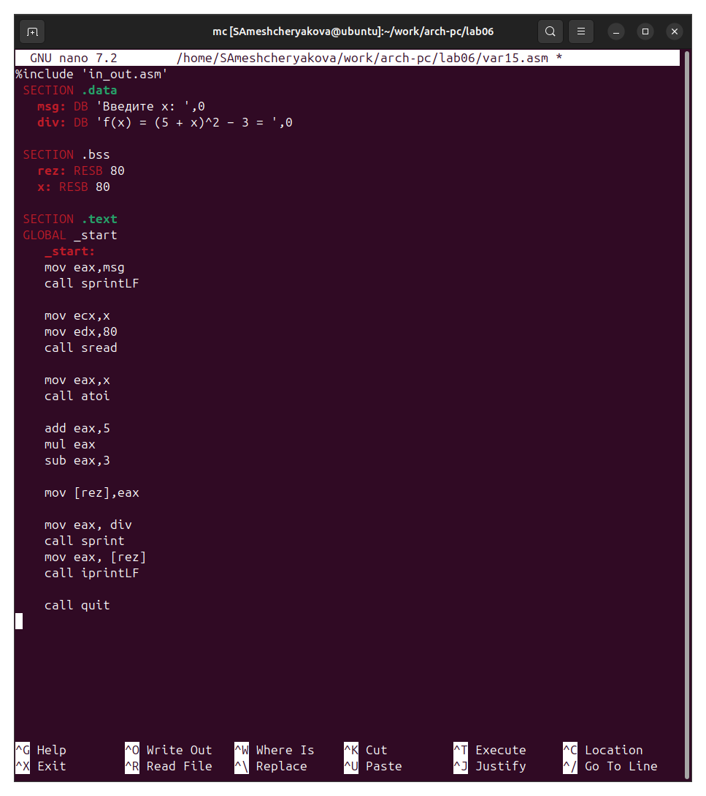{#fig-19 width=70%}

Создадим исполняемые файлы и запустим их ([рис. @fig-019], [@fig-020]).

{#fig-019 width=70%}

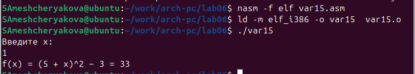{#fig-020 width=70%}

# Выводы

Мы приобрели навыки создания исполнительных файлов для решения выражений и освоили арифметические инструкции в NASM.
