---
## Author
author:
  name: Мещерякова София Андреевна
  affiliation:
    - name: Российский университет дружбы народов
      country: Российская Федерация
      postal-code: 117198
      city: Москва
      address: ул. Миклухо-Маклая, д. 6

## Title
title: "Отчёт по лобораторной работе №7"
subtitle: "Команды безусловного и условного переходов в Nasm. Программирование ветвлений."
license: "CC BY"
--- 


# Цель работы

Изучение команд условного и безусловного переходов. Приобретение навыков написания
программ с использованием переходов. Знакомство с назначением и структурой файла
листинга.

# Выполнение лабораторной работы

## Реализация переходов в NASM

1. Создадим каталог для программ лабораторной работы № 7, перейдём в него и
создадим файл lab7-1.asm ([рис. @fig-001]).

{#fig-001 width=90%}

2. Рассмотрим пример программы с использованием инструкции jmp. Введем в файл lab7-1.asm текст программы из листинга 7.1 ([рис. @fig-002]).

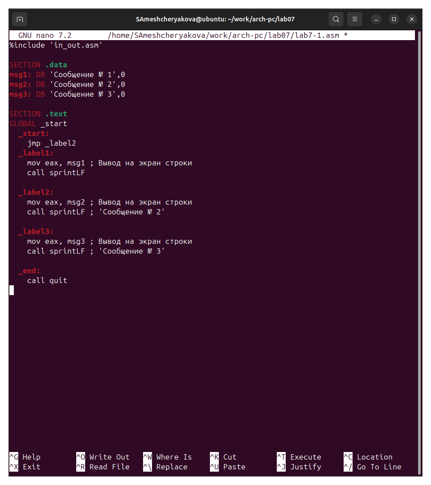{#fig-002 width=90%}

Создадим исполняемый файл и запустим его ([рис. @fig-003]).

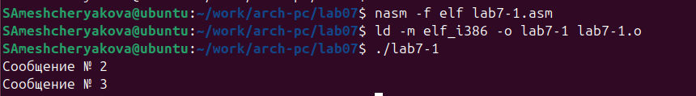{#fig-003 width=90%}

*Листинг 7.1*

```nasm
%include 'in_out.asm'

SECTION .data
msg1: DB 'Сообщение № 1',0
msg2: DB 'Сообщение № 2',0
msg3: DB 'Сообщение № 3',0

SECTION .text
GLOBAL _start
  _start:
    jmp _label2

  _label1:
    mov eax, msg1 
    call sprintLF

  _label2:
    mov eax, msg2 
    call sprintLF 

  _label3:
    mov eax, msg3 
    call sprintLF 

  _end:
    call quit
```

Изменим программу таким образом, чтобы она выводила сначала ‘Сообщение № 2’, потом ‘Сообщение № 1’ и завершала работу. Измените текст программы в соответствии с листингом 7.2 ([рис. @fig-004]).

*Листинг 7.2*
```nasm
%include 'in_out.asm'

SECTION .data
msg1: DB 'Сообщение № 1',0
msg2: DB 'Сообщение № 2',0
msg3: DB 'Сообщение № 3',0

SECTION .text
GLOBAL _start
  _start:
    jmp _label2

  _label1:
    mov eax, msg1 ; Вывод на экран строки
    call sprintLF
    jmp _end

  _label2:
    mov eax, msg2 ; Вывод на экран строки
    call sprintLF ; 'Сообщение № 2'
    jmp _label1

  _label3:
    mov eax, msg3 ; Вывод на экран строки
    call sprintLF ; 'Сообщение № 3'

  _end:
    call quit
```


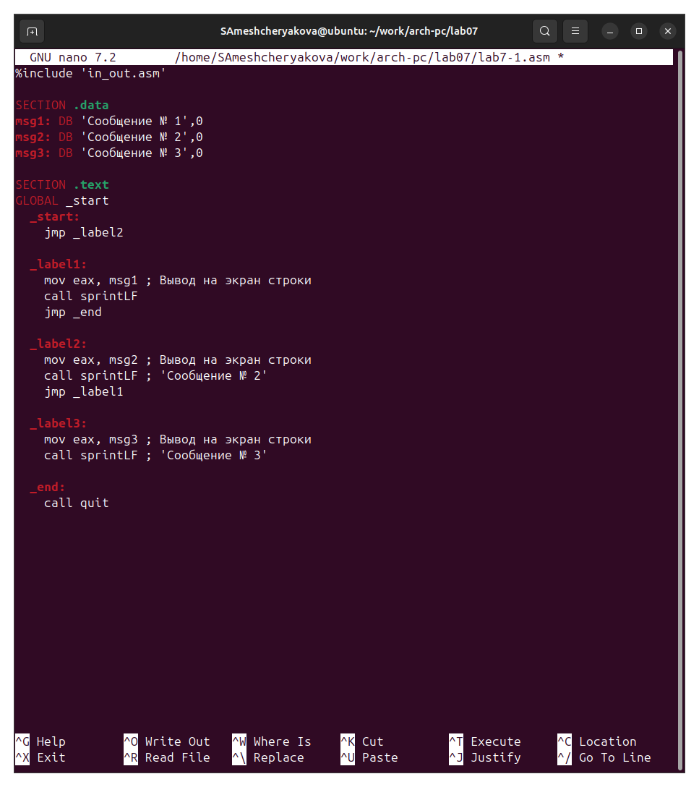{#fig-004 width=90%}

Создадим исполняемый файл и проверим его работу ([рис. @fig-005]).

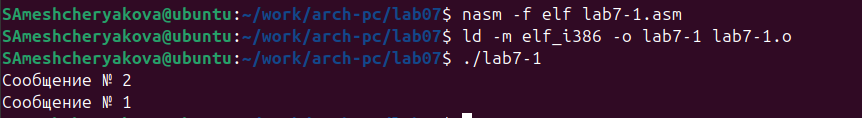{#fig-005 width=90%}

Изменим текст программы, чтобы она выводила все 3 сообщения ([рис. @fig-006]).

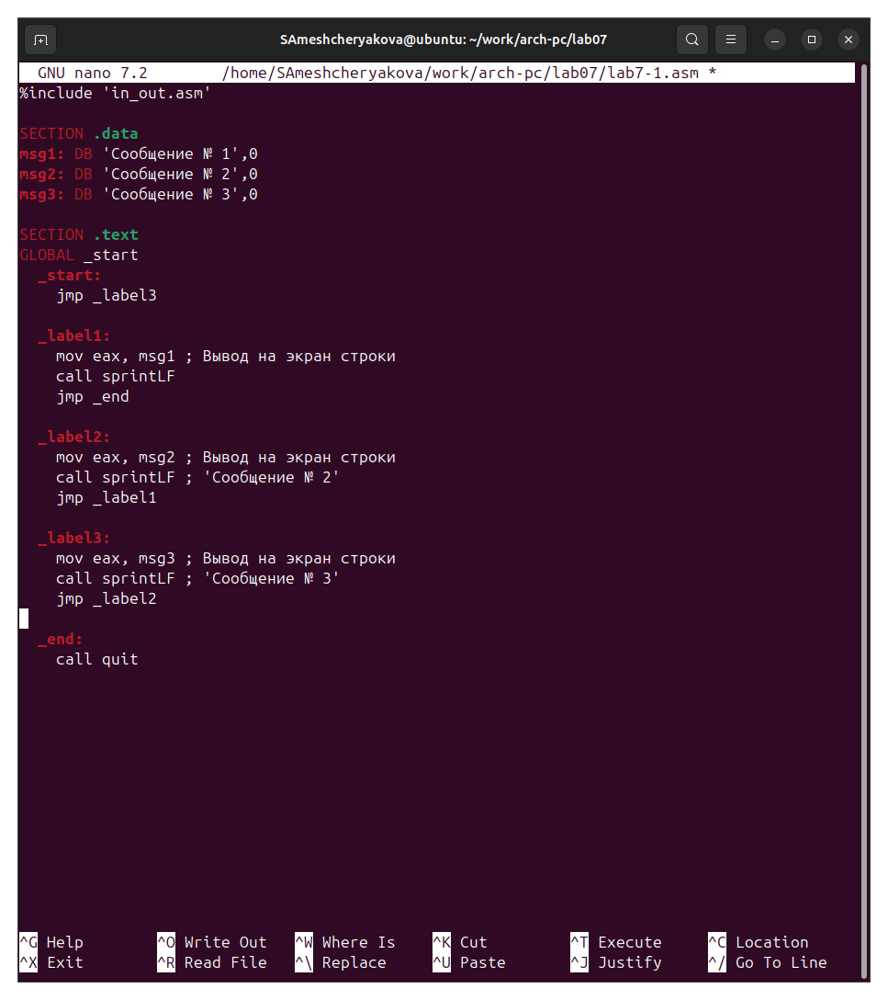{#fig-006 width=90%}

Создадим исполняемый файл и проверим его работу ([рис. @fig-007]).

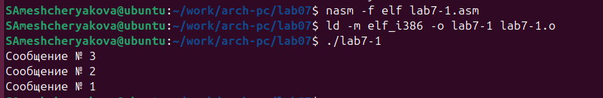{#fig-007 width=90%}

*Листинг 7.2 (изменённый)*

```nasm
%include 'in_out.asm'

SECTION .data
msg1: DB 'Сообщение № 1',0
msg2: DB 'Сообщение № 2',0
msg3: DB 'Сообщение № 3',0

SECTION .text
GLOBAL _start
  _start:
    jmp _label3

  _label1:
    mov eax, msg1 
    call sprintLF
    jmp _end
    
  _label2:
    mov eax, msg2 
    call sprintLF 
    jmp _label1

  _label3:
    mov eax, msg3 
    call sprintLF 
    jmp _label2

  _end:
    call quit
```

3. Создадим файл lab7-2.asm в каталоге ~/work/arch-pc/lab07 ([рис. @fig-008]). Изучим текст программы из листинга 7.3 и введем в lab7-2.asm ([рис. @fig-009]).

{#fig-008 width=90%}

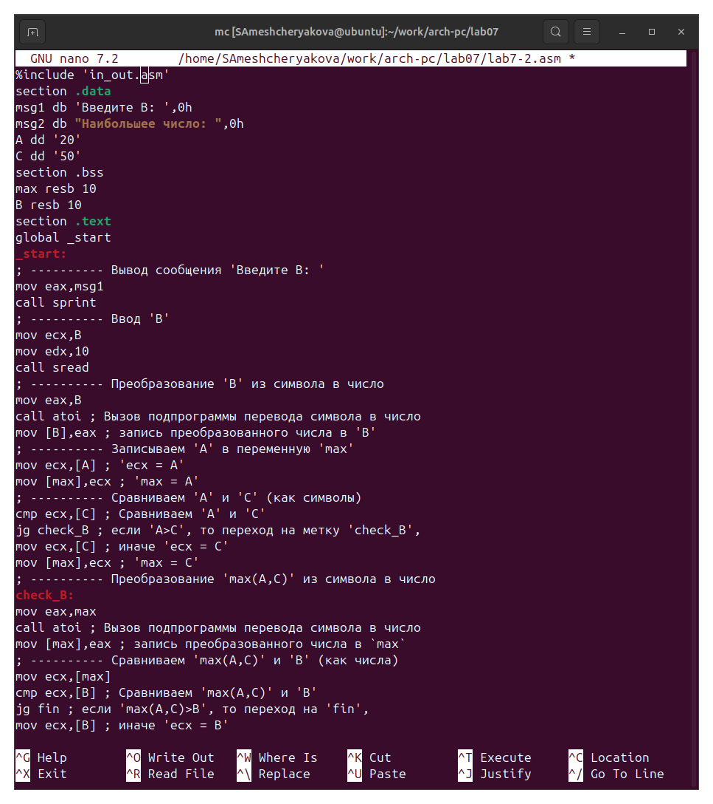{#fig-009 width=90%}

*Листинг 7.3*

```nasm
%include 'in_out.asm'
section .data
  msg1 db 'Введите B: ',0h
  msg2 db "Наибольшее число: ",0h
  A dd '20'
  C dd '50'
section .bss
  max resb 10
  B resb 10
section .text
  global _start
_start:
  mov eax,msg1
  call sprint
  mov ecx,B
  mov edx,10
  call sread
  mov eax,B
  call atoi
  mov [B],eax
  mov ecx,[A]
  mov [max],ecx 
  cmp ecx,[C]
  jg check_B 
  mov ecx,[C] 
  mov [max],ecx 
check_B:
  mov eax,max
  call atoi 
  mov [max],eax
  mov ecx,[max]
  cmp ecx,[B]
  jg fin 
  mov ecx,[B] 
  mov [max],ecx
fin:
  mov eax, msg2
  call sprint
  mov eax,[max]
  call iprintLF 
  call quit 
```

Создадим исполняемый файл и проверим его работу при разных значениях В ([рис. @fig-010]).

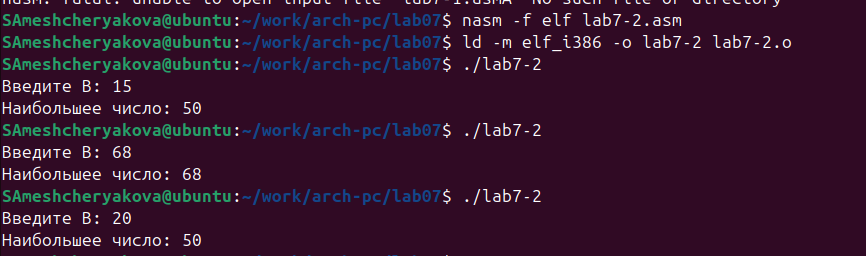{#fig-010 width=90%}

## Изучение структуры файлы листинга

4. Создадим файл листинга для программы из файла lab7-2.asm  ([рис. @fig-011]).

{#fig-011 width=90%}

Откроем файл листинга lab7-2.lst с помощью любого текстового редактора, например
mcedit  ([рис. @fig-012]).

{#fig-012 width=90%}

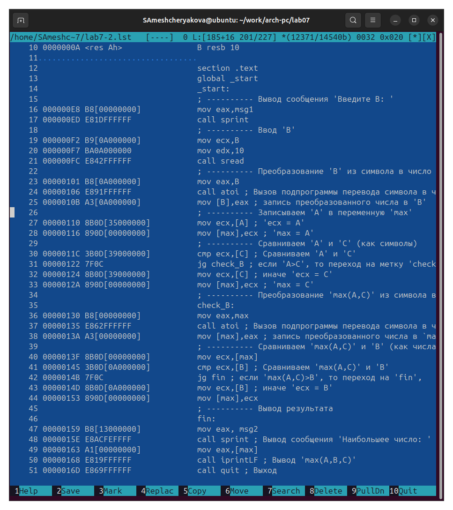{#fig-013 width=90%}

Внимательно ознакомиться с его форматом и содержимым. Подробно объяснить содержи-
мое трёх строк файла листинга по выбору  ([рис. @fig-112]).

{#fig-112 width=90%}

23: 00000101 - адрес в сегменте кода, B8 - опкод инструкции mov для загрузки значения в eax, [0A000000] - адрес В, mov eax, B - приствоение eax значения B.

24: 00000106 - адрес в сегменте кода, E8 - опкод инструкции call, 91FFFFFF - смещение относительно текущей позиции, по которому находится функция atoi, call atoi - высов функции

25: 0000010B - адрес в сегменте кода, A3 - опкод инструкции mov для записи значения в память, [0A000000] - адрес В, mov [B], eax - запись числа в В


Откроем файл с программой lab7-2.asm и в любой инструкции с двумя операндами
удалим один операнд ([рис. @fig-014]). 

{#fig-014 width=90%}

Выполним трансляцию с получением файла листинга  ([рис. @fig-015]).

{#fig-015 width=90%}

Создается файл листинга  lab7-2.lst, в котором добавлено сообщение об ошибке в измененной нами строке ([рис. @fig-016]).

{#fig-016 width=90%}


## Выполнение заданий для самостоятельной работы

В соответствии с вариантом, полученным при выполнении лабораторной работы №6, выполняем задания 15 варианта ([рис. @fig-111]).

{#fig-111 width=90%}

1. Напишем программу нахождения наименьшей из 3 целочисленных переменных a, b и c. Значения $(a, b, c) = (32, 6, 54)$ ([рис. @fig-017]).

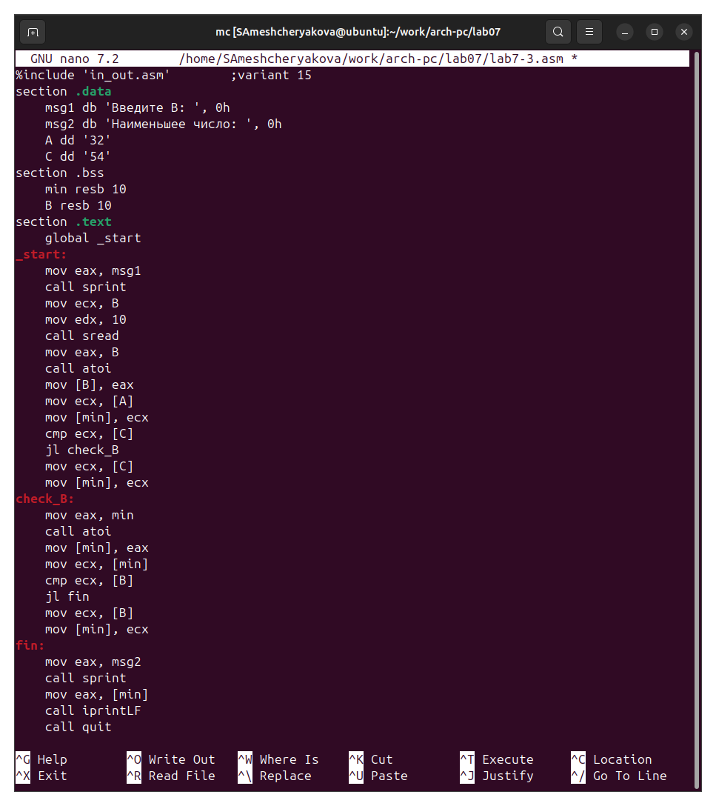{#fig-017 width=90%}

Создадим исполняемый файл и проверим его работу ([рис. @fig-018]).

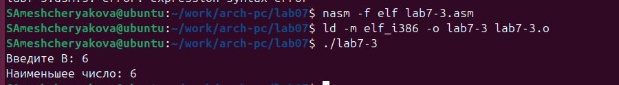{#fig-018 width=90%}

*Листинг 7.4*

```nasm

%include 'in_out.asm'        ;variant 15
section .data
    msg1 db 'Введите B: ', 0h
    msg2 db 'Наименьшее число: ', 0h
    A dd '32'
    C dd '54'

section .bss
    min resb 10
    B resb 10

section .text
    global _start

_start:
    mov eax, msg1
    call sprint
    mov ecx, B
    mov edx, 10
    call sread
    mov eax, B
    call atoi
    mov [B], eax
    mov ecx, [A]
    mov [min], ecx
    cmp ecx, [C]
    jl check_B
    mov ecx, [C]
    mov [min], ecx

check_B:
    mov eax, min
    call atoi
    mov [min], eax
    mov ecx, [min]
    cmp ecx, [B]
    jl fin
    mov ecx, [B]
    mov [min], ecx

fin:
    mov eax, msg2
    call sprint
    mov eax, [min]
    call iprintLF
    call quit
```

2. Напишем программу, которая для введенных с клавиатуры значений x и a вычисляет
значение заданной функции $f(x)$ и выводит результат вычислений ([рис. @fig-019]).

Вариант 15: 

$$ f(x) = \begin{cases} a + 10, x < a \\ x + 10, x >= a  \end{cases} $$

Значения для подстановки (x,a): (2, 3), (4, 2).

*Листинг 7.5*

```nasm

%include 'in_out.asm'
SECTION .data
   msg1: DB 'Введите a: ', 0h
   msg2: DB 'Введите x: ', 0h
   msg3: DB 'F(x) = ', 0h

SECTION .bss
    x:   RESB 10
    a:   RESB 10
    res: RESB 10

SECTION .text
  global _start
   _start:
    mov eax,msg1
    call sprint
    mov ecx,a
    mov edx,10
    call sread
    mov eax,a
    call atoi
    mov [a],eax

    mov eax,msg2
    call sprint
    mov ecx,x
    mov edx,10
    call sread
    mov eax,x
    call atoi
    mov [x],eax
    cmp eax,[a]
    jl less_than_a
    jge greater_a

less_than_a:
    mov eax, [a]
    add eax, 10
    mov [res], eax
    jmp fin

greater_a:
    mov eax, [x]
    add eax, 10
    mov [res], eax
    jmp fin

fin:
   mov eax, msg3
   call sprint
   mov eax, [res]
   call iprintLF
   call quit
```

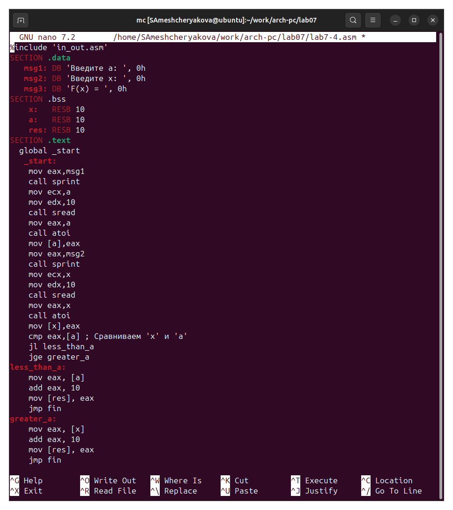{#fig-019 width=90%}

Создадим исполняемый файл и проверим его работу ([рис. @fig-020,  @fig-021,  @fig-022]).

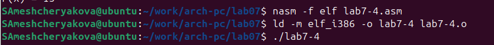{#fig-020 width=90%}

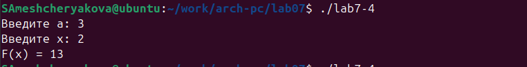{#fig-021 width=90%}

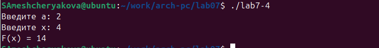{#fig-022 width=90%}

# Выводы

Мы познакомились с структурой файла листинга, изучили команды условного и безусловного перехода.
