---
## Author
author:
  name: Мещерякова София Андреевна
  affiliation:
    - name: Российский университет дружбы народов
      country: Российская Федерация
      postal-code: 117198
      city: Москва
      address: ул. Миклухо-Маклая, д. 6

## Title
title: "Отчёт по лобораторной работе №8"
subtitle: "Программирование цикла. Обработка аргументов командной строки."
license: "CC BY"
--- 

# Цель работы

Приобретение навыков написания программ с использованием циклов и обработкой
аргументов командной строки.

# Выполнение лабораторной работы

## Реализация циклов в NASM

1. Создадим каталог для программ лабораторной работы № 8, перейдём в него и
создадим файл lab8-1.asm ([рис. @fig-001]).

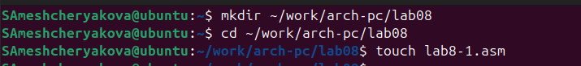{#fig-001 width=90%}

В качестве примера рассмотрим программу, которая выводит значение регистра ecx. Введем файл программу из листинга 8.1 ([рис. @fig-002]).

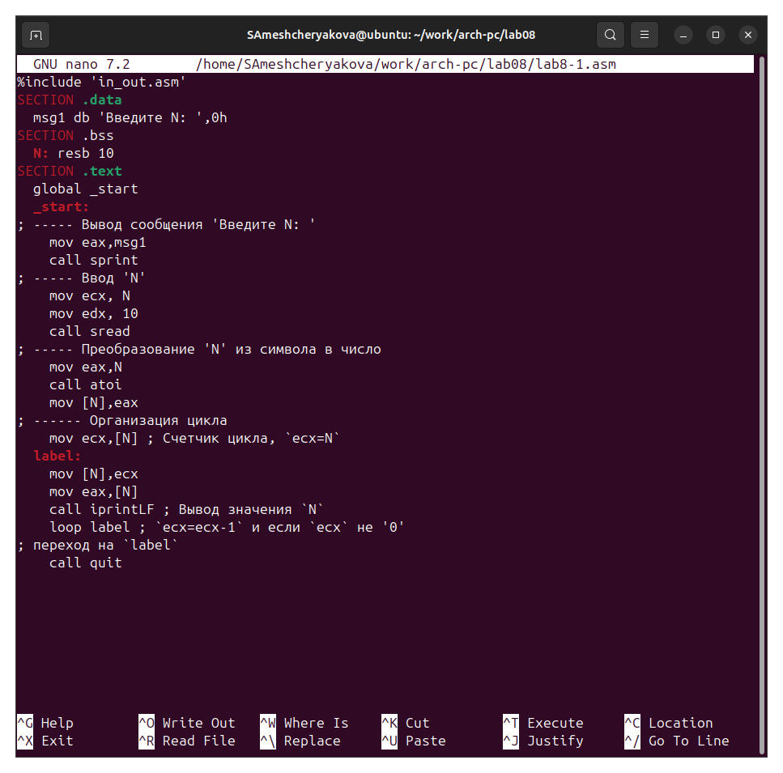{#fig-002 width=90%}

Создаем исполняемый файл и запускаем его ([рис. @fig-003]).

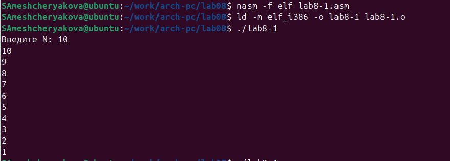{#fig-003 width=90%}

Изменяем файл, добавив изменение значения регистра в цикле ([рис. @fig-004]).

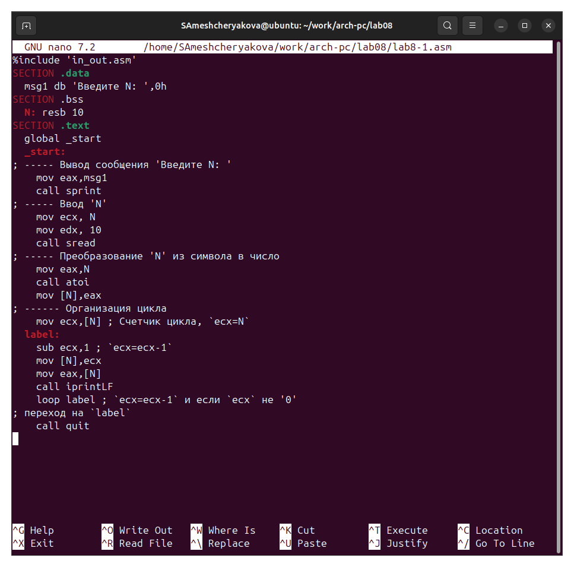{#fig-004 width=90%}

Создаем исполняемый файл и запускаем его ([рис. @fig-005]).

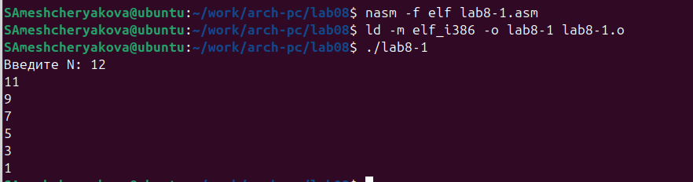{#fig-005 width=90%}

Регистр ecx принимает значения 11, 9, 7, 5, 3, 1 (на вход подается число 12, в цикле регистр уменьшается на 2).

Число проходов цикла не соответсвует числу N.

Изменяем файл, чтобы он работал корректно ([рис. @fig-006]).

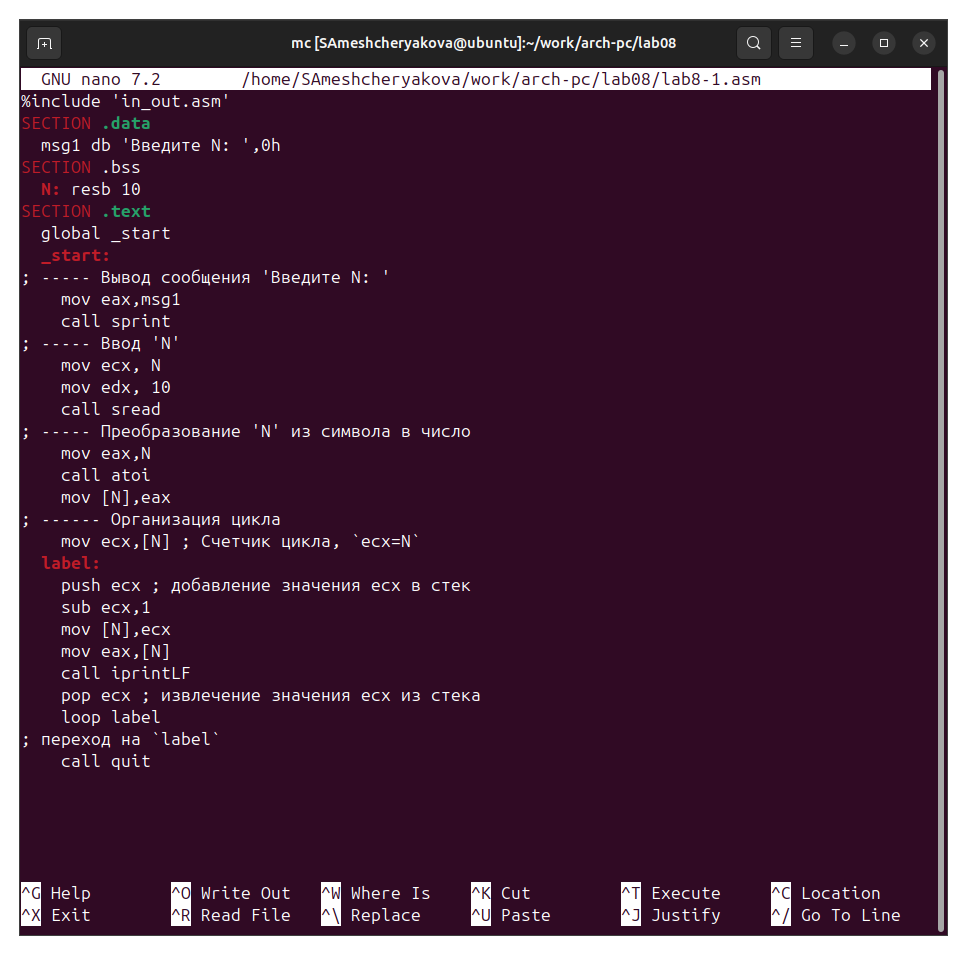{#fig-006 width=90%}

Создаем исполняемый файл и запускаем его ([рис. @fig-007]).

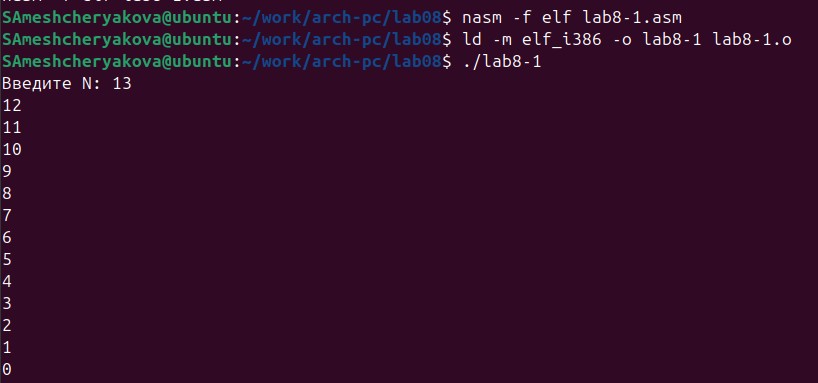{#fig-007 width=90%}

В данном случае число проходов цикла равна числу N.

## Обработка аргументов командной строки.

Создаем новый файл ([рис. @fig-008]).

{#fig-008 width=90%}

Введем файл программу из листинга 8.2 ([рис. @fig-009]).

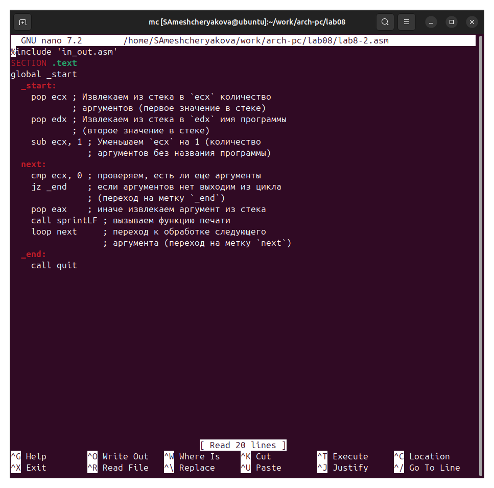{#fig-009 width=90%}

Создаем исполняемый файл и проверяем его работу, указав аргументы ([рис. @fig-010]).

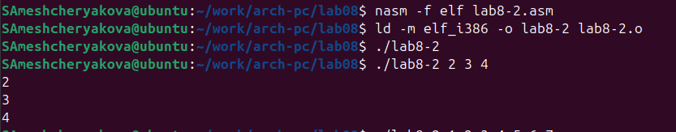{#fig-010 width=90%}

Програмой было обработано 3 аргумента.

Создаем новый файл lab8-3.asm ([рис. @fig-011]).

{#fig-011 width=90%}

Введем файл программу из листинга 8.3 ([рис. @fig-012]).

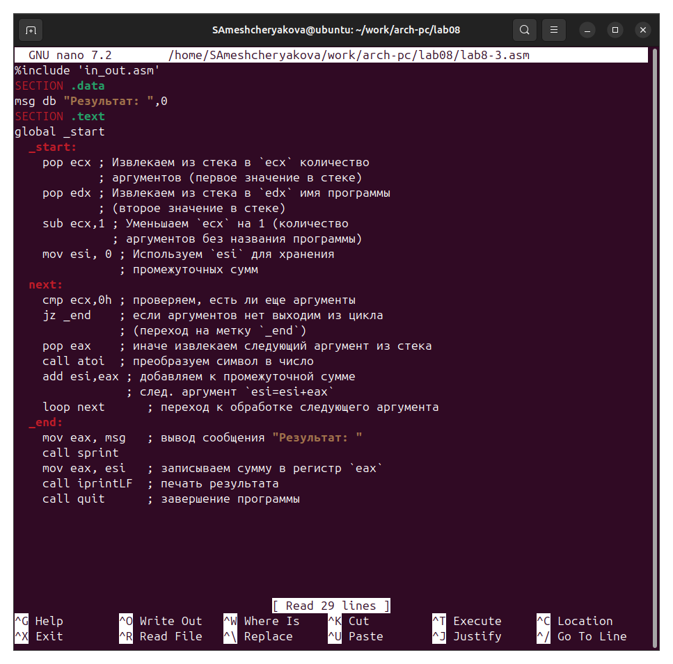{#fig-012 width=90%}

Создаём исполняемый файл и запускаем его, указав аргументы ([рис. @fig-013]).

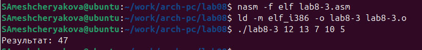{#fig-013 width=90%}

Изменяем его, чтобы вычислялось произведение вводимых значений ([рис. @fig-014]).

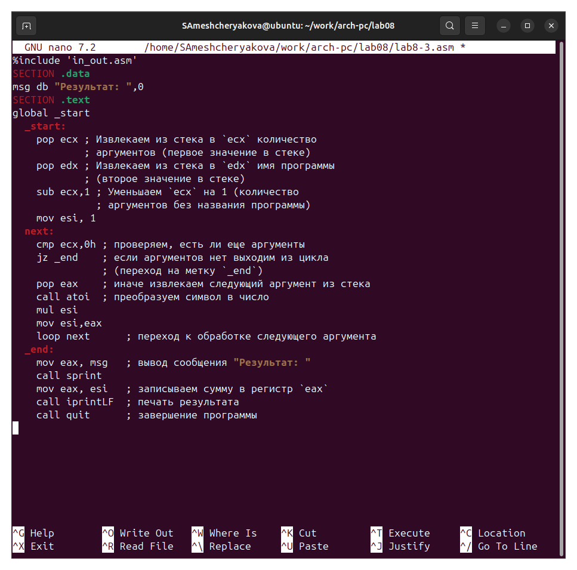{#fig-014 width=90%}

Создаём исполняемый файл и запускаем его, указав аргументы ([рис. @fig-015]).

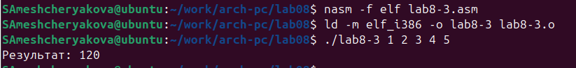{#fig-015 width=90%}

## Задание для самостоятельной работы

Вариант 15

1. Напишите программу, которая находит сумму значений функции $f(x) для x = x_1, x_2, ..., x_n$, т.е. программа должна выводить значение $f(x_1) + f(x_2) + ... + f(x_n)$. Значения $x_i$ передаются как аргументы. Вид функции $f(x)$ выбрать из таблицы 8.1 вариантов заданий в соответствии с вариантом, полученным при выполнении лабораторной работы № 7. Создайте исполняемый файл и проверьте его работу на нескольких наборах $x = x_1, x_2, ..., x_n$.

Пишем программу, которая выведет сумму значений, получившихся после решения выражения $6x + 13$ ([рис. @fig-016]).

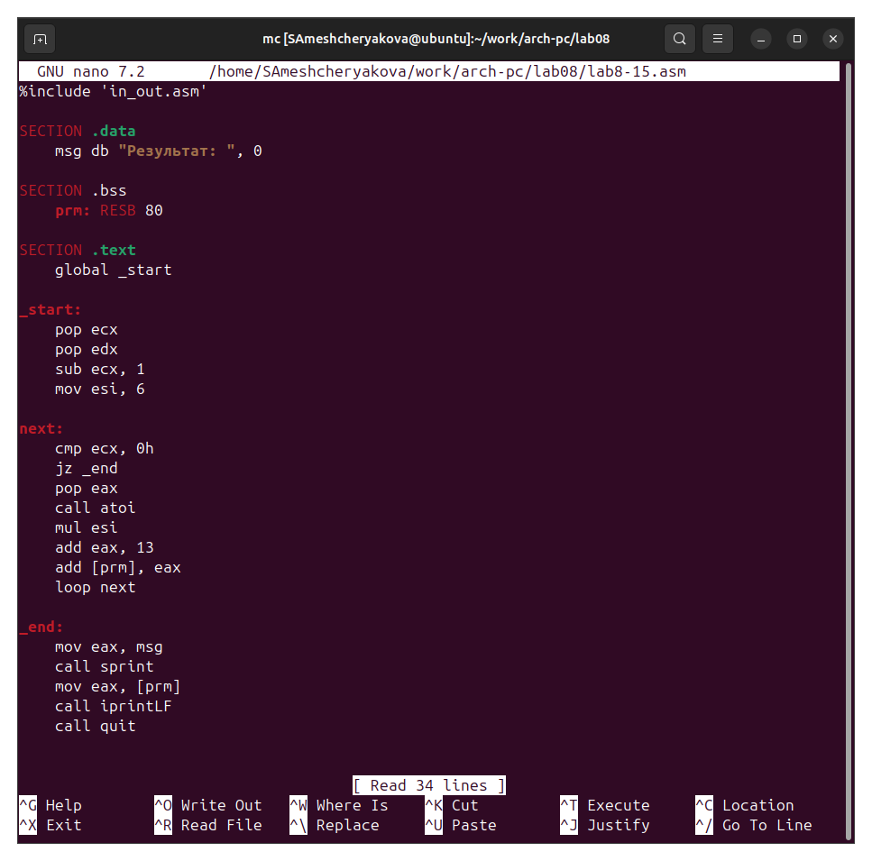{#fig-016 width=90%}

Создаём исполняемый файл и запускаем его, указав аргументы ([рис. @fig-017]).

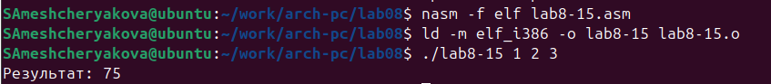{#fig-017 width=90%}

Запустим файл при других значениях х ([рис. @fig-017]).

{#fig-017 width=90%}

# Выводы

Мы научились решать программы с использованием циклов и обработкой
аргументов командной строки.

