---
## Author
author:
  name: Мещерякова София Андреевна
  affiliation:
    - name: Российский университет дружбы народов
      country: Российская Федерация
      postal-code: 117198
      city: Москва
      address: ул. Миклухо-Маклая, д. 6

## Title
title: "Отчёт по лобораторной работе №9"
subtitle: "Понятие подпрограммы. Отладчик GDB."
license: "CC BY"
--- 

# Цель работы

Приобретение навыков написания программ с использованием подпрограмм. Знакомство
с методами отладки при помощи GDB и его основными возможностями.

# Выполнение лабораторной работы

## Реализация подпрограмм в NASM

1. Создадим каталог для программ лабораторной работы № 9, перейдём в него и
создадим файл lab09-1.asm ([рис. @fig-001]).

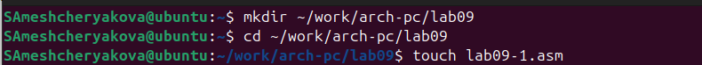{#fig-001 width=90%}

Открываем файл и вводим программу из листинга 9.1 ([рис. @fig-002]).

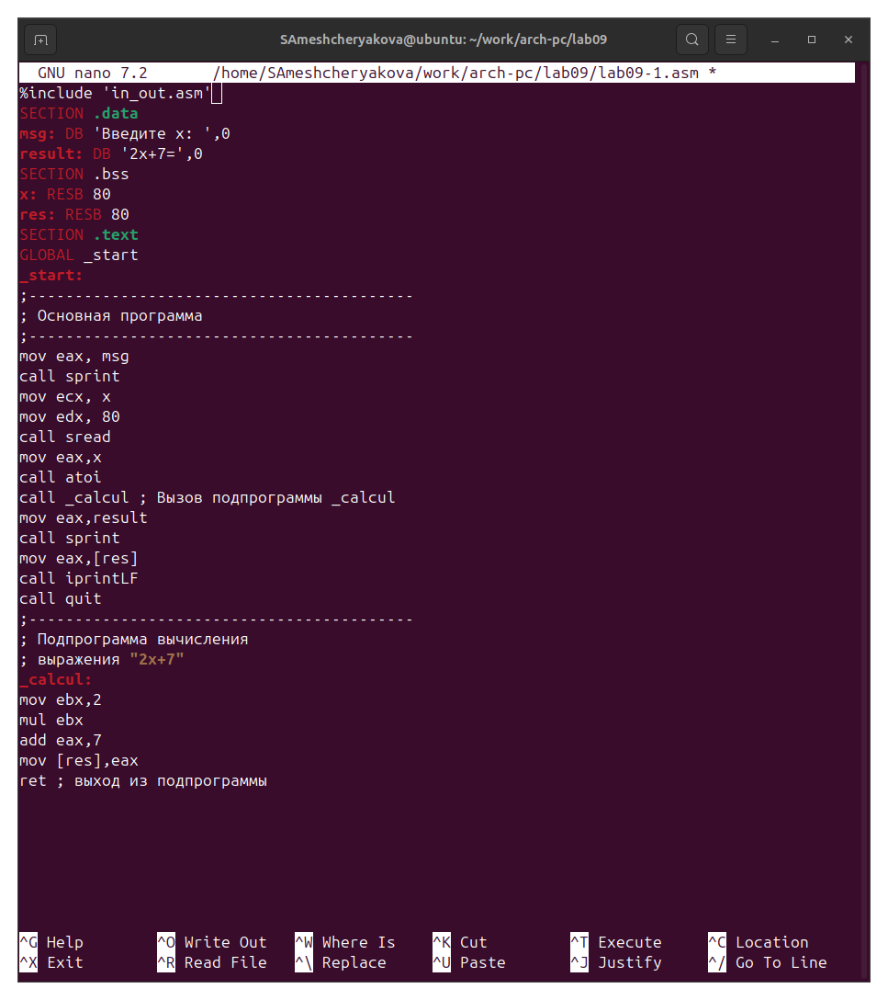{#fig-002 width=90%}

Создаем исполняемый файл и запускаем его ([рис. @fig-003]).

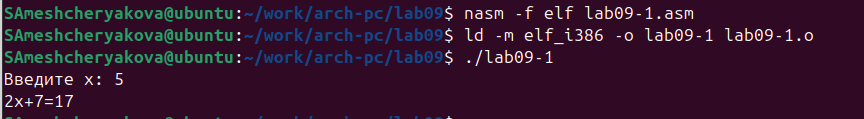{#fig-003 width=90%}

Изменяем файл, добавив подпрограмму _subcalcul ([рис. @fig-004]).

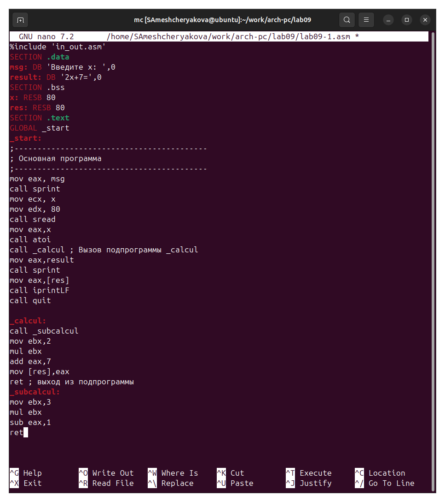{#fig-004 width=90%}

Создаем исполняемый файл и запускаем его ([рис. @fig-005]).

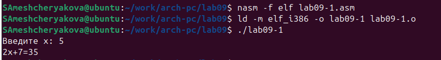{#fig-005 width=90%}

## Отладка программам с помощью GDB

Создадим файл lab09-2.asm ([рис. @fig-006]).

{#fig-006 width=90%}

Открываем файл и вводим программу из листинга 9.2 ([рис. @fig-007]).

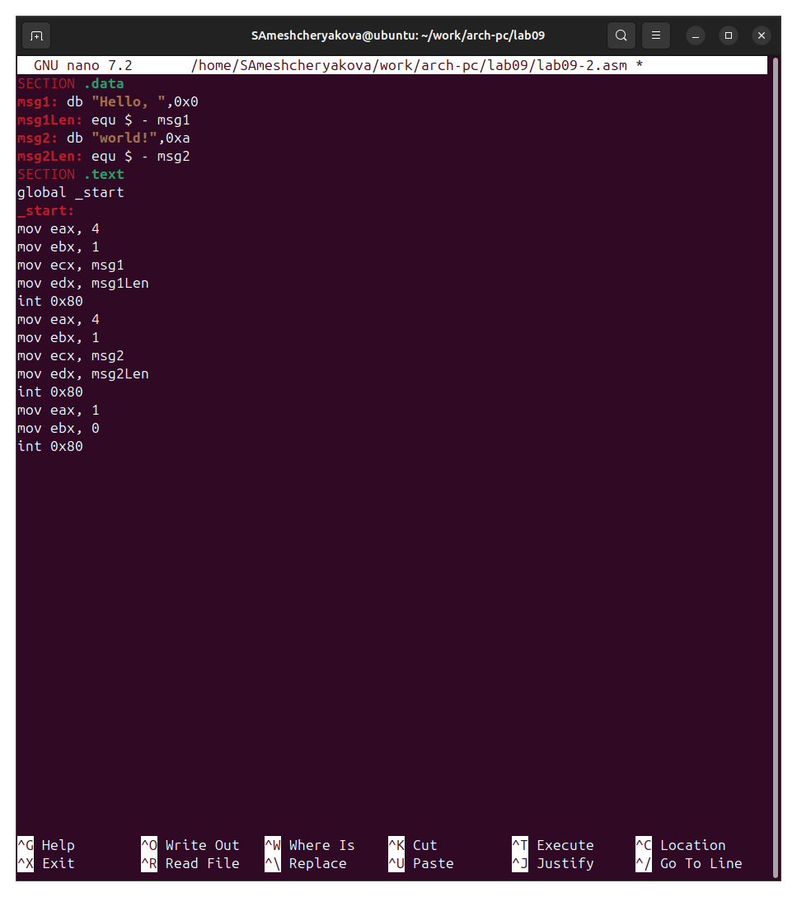{#fig-007 width=90%}

Получим исходный файл с использованием отладчика gdb ([рис. @fig-008]).

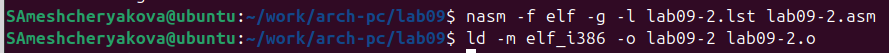{#fig-008 width=90%}

Загрузим файл в отладчик и запустим в нем программу ([рис. @fig-009]).

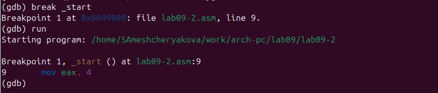{#fig-010 width=90%}

Устанавливаем брейкпоинт на метку _start и запускаем программу ([рис. @fig-010]).

{#fig-010 width=90%}

Смотрим дисассимилированный код программы, начиная с метки _start ([рис. @fig-011]).

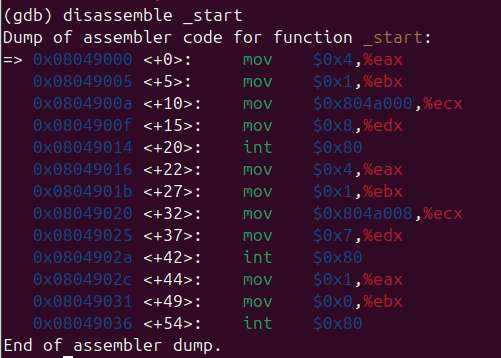{#fig-011 width=90%}

Переключаемся на отображение команд с Intel’овским синтаксисом ([рис. @fig-012]).

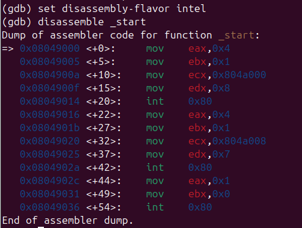{#fig-012 width=90%}

Различия отображения синтаксиса машинных команд в режимах ATT и Intel:

1. Порядок операндов:

    ATT: исходный операнд, затем результирующий, Intel: результирующий операнд, затем исходный.

2. Разделители:

    ATT: запятые, Intel: запятые или косые черты (/).

3. Указание размера операндов:

    ATT: префиксы перед операндом (b, w, l, q), Intel: суффиксы после операнда (b, w, d, q).

4. Знак операндов:

    ATT: положительные значения начинаются с $, Intel: положительные значения без $.

5. Обозначение адресов:

    ATT: в круглых скобках, Intel: без скобок.

6. Обозначение регистров:

    ATT: с символом % (например, %eax), Intel: без %, может начинаться с R или E (например, RAX, EAX).
    
    
Включаем режим псевдографики ([рис. @fig-013]).

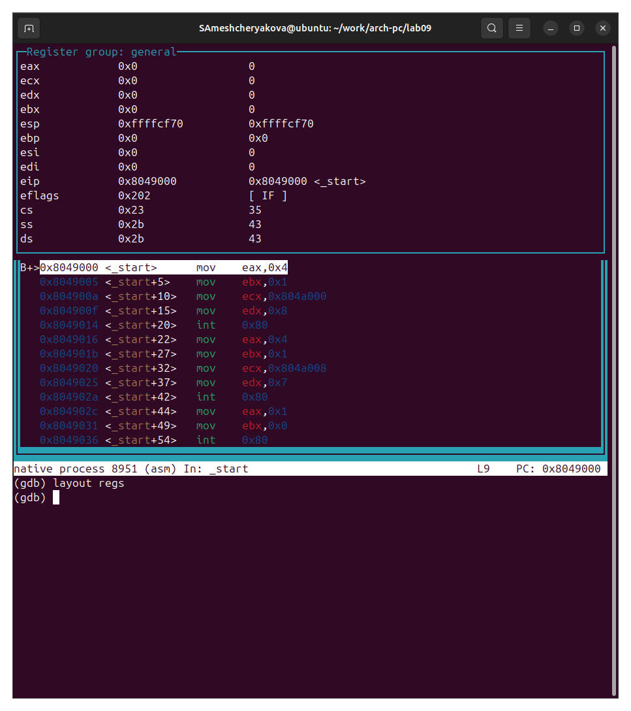{#fig-013 width=90%}

Проверяем была ли установлена точка остановки ([рис. @fig-014]).

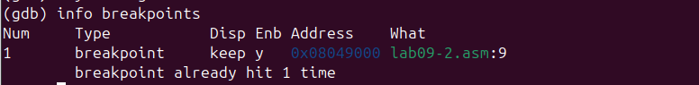{#fig-014 width=90%}

Установим еще один брейкпоинт ([рис. @fig-015]).

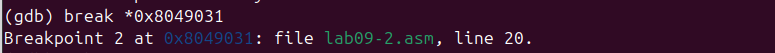{#fig-015 width=90%}

Посмотрим информацию о всех установленных точках останова ([рис. @fig-016]).

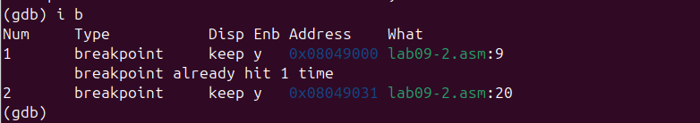{#fig-016 width=90%}

Выполняем 5 инструкций командой si ([рис. @fig-017]).

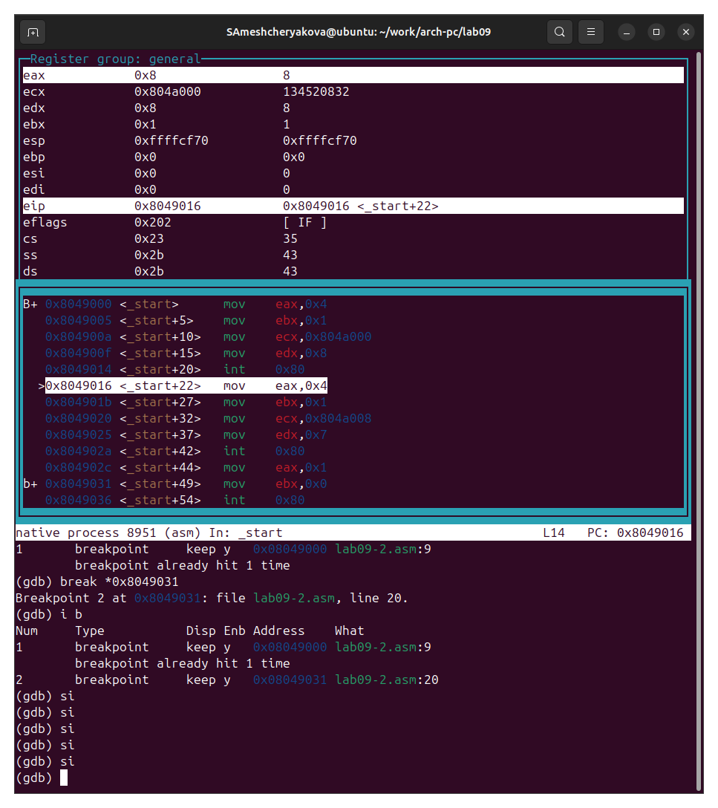{#fig-017 width=90%}

Во время выполнения команд менялись регистры: ebx, ecx, edx, eax, eip.

Смотрим значение переменной msg1 по имени ([рис. @fig-018]).

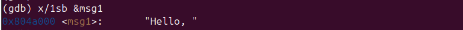{#fig-018 width=90%}

Смотрим значение переменной msg2 по адресу ([рис. @fig-019]).

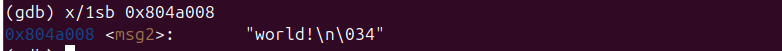{#fig-019 width=90%}

Изменим первый символ переменной msg1 ([рис. @fig-020]).

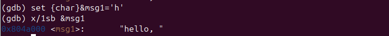{#fig-020 width=90%}

Изменим первый символ переменной msg2 ([рис. @fig-021]).

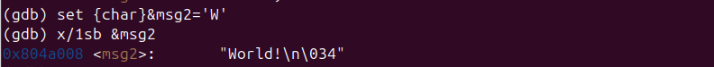{#fig-021 width=90%}

Смотрим значение регистра edx в разных форматах ([рис. @fig-022]).

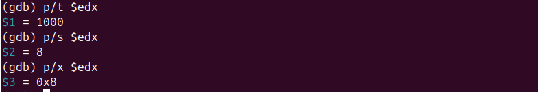{#fig-022 width=90%}

Изменяем регистор ebx ([рис. @fig-023]).

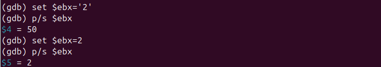{#fig-023 width=90%}

Выводится разные значения, так как команда без кевычек присваивает регистру числовое значение (его и выводит), а '2'- строковое значение.

Прописываем команды для завершения программы и выхода из GDB ([рис. @fig-024]).

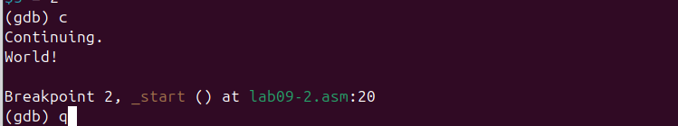{#fig-024 width=90%}

Копируем файл lab8-2.asm в файл с именем lab09-3.asm0 ([рис. @fig-025]).

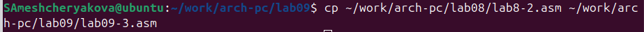{#fig-025 width=90%}

Создадим исполняемый файл и загрузим его в отладчик GDB ([рис. @fig-026] [, @fig-027]).

{#fig-026 width=90%}

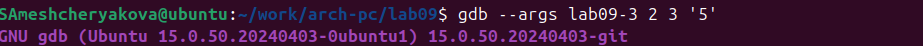{#fig-027 width=90%}

Установим точку останова перед первой инструкцией в программе и запустим ее ([рис. @fig-028]).

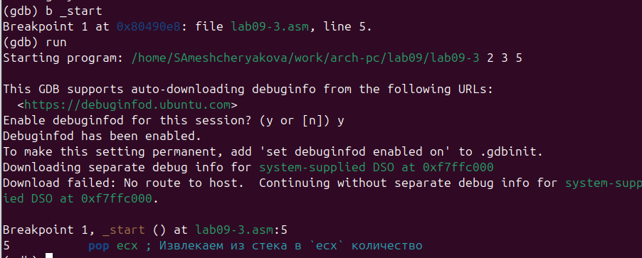{#fig-028 width=90%}

Смотрим адрес вершины стека ([рис. @fig-029]).

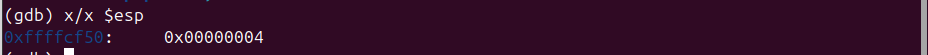{#fig-029 width=90%}

Смотрим значения стека по разным адресам ([рис. @fig-030]).

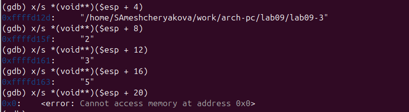{#fig-030 width=90%}

Шаг изменения адреса равен 4 потому что адресные регистры имеют размерность 4 байта.

##Задание для самостоятельной работы

1. Преобразуйте программу из лабораторной работы №8 (Задание №1 для самостоятель-
ной работы), реализовав вычисление значения функции $f(x)$ как подпрограмму.

Открываем файл lab09-15.asm (копия файла lab8-15.asm) и изменим его ([рис. @fig-031]).

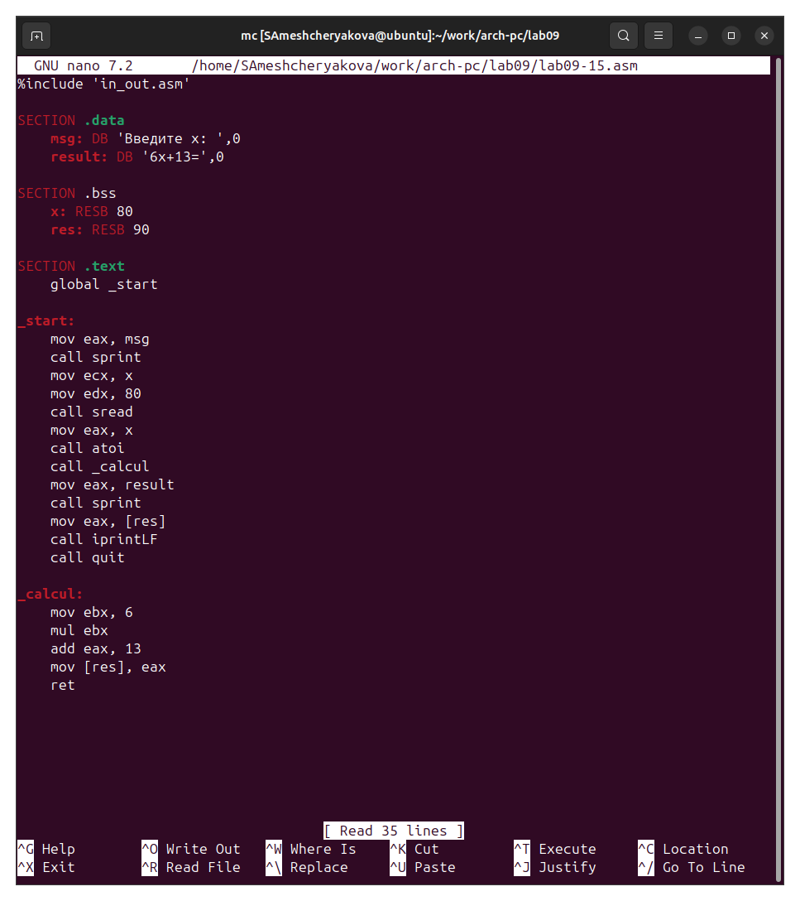{#fig-031 width=90%}

Создадим исполняемый файл и запустим его ([рис. @fig-032]).

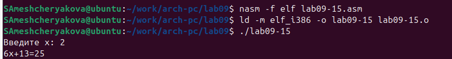{#fig-032 width=90%}

2. В листинге 9.3 приведена программа вычисления выражения $(3 + 2) ∗ 4 + 5$. При запуске данная программа дает неверный результат. Проверьте это. С помощью отладчика GDB, анализируя изменения значений регистров, определите ошибку и исправьте ее.

Создаем новый файл и вводим туда текст программы из листинга 9.3 ([рис. @fig-033]).

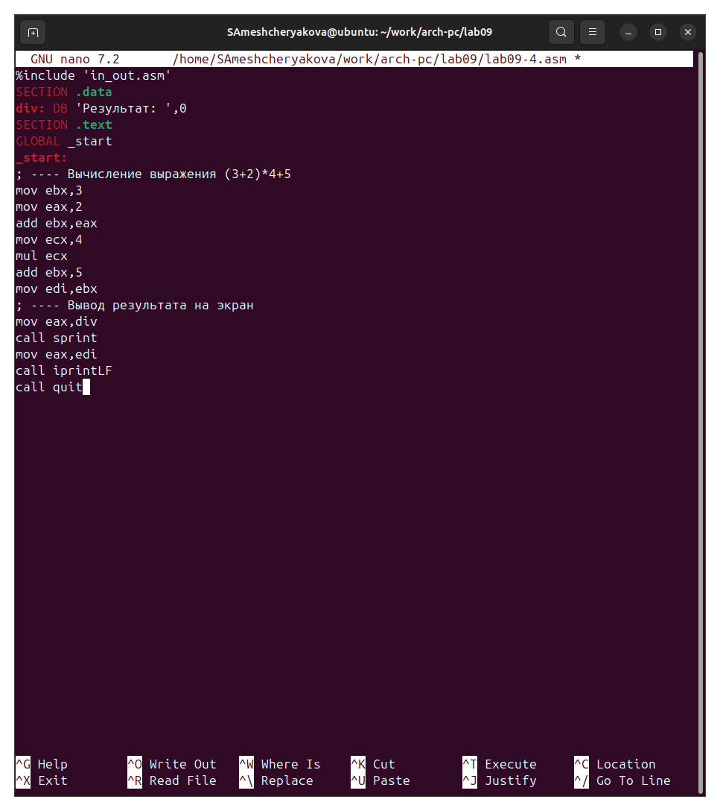{#fig-033 width=90%}

Создадим исполняемый файл и запустим его ([рис. @fig-034]).

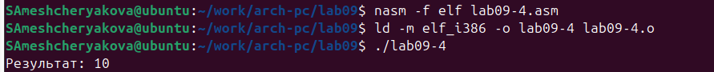{#fig-034 width=90%}

Создаем исполняемый файл и запускаем его в отладчике GDB и смотрим на изменение регистров командой si ([рис. @fig-035]).

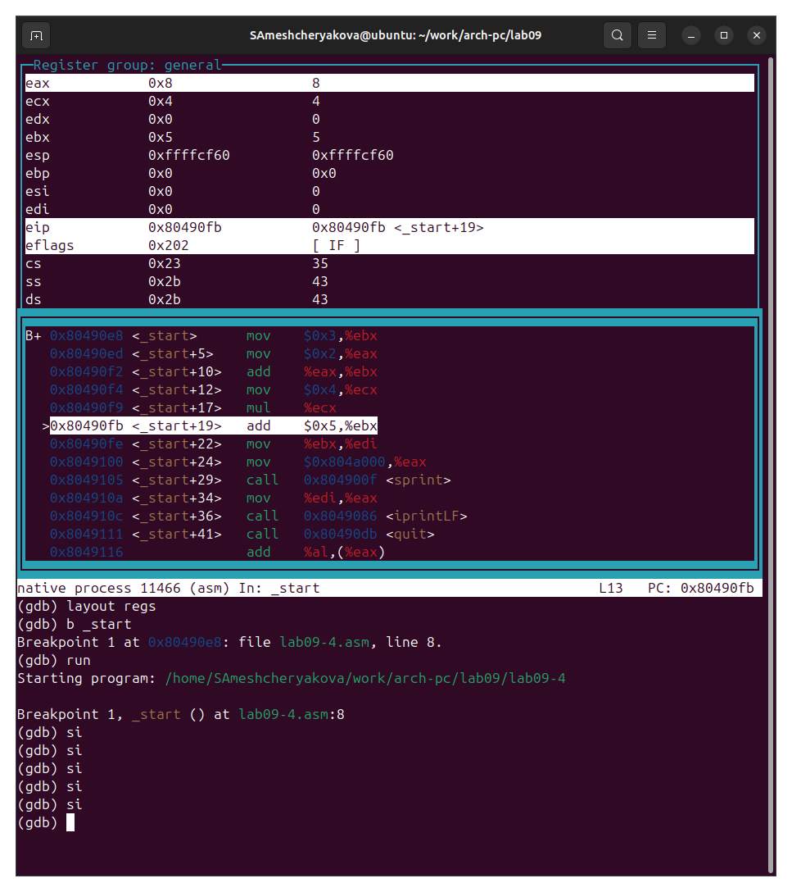{#fig-035 width=90%}

Изменяем программу для корректной работы ([рис. @fig-036]).

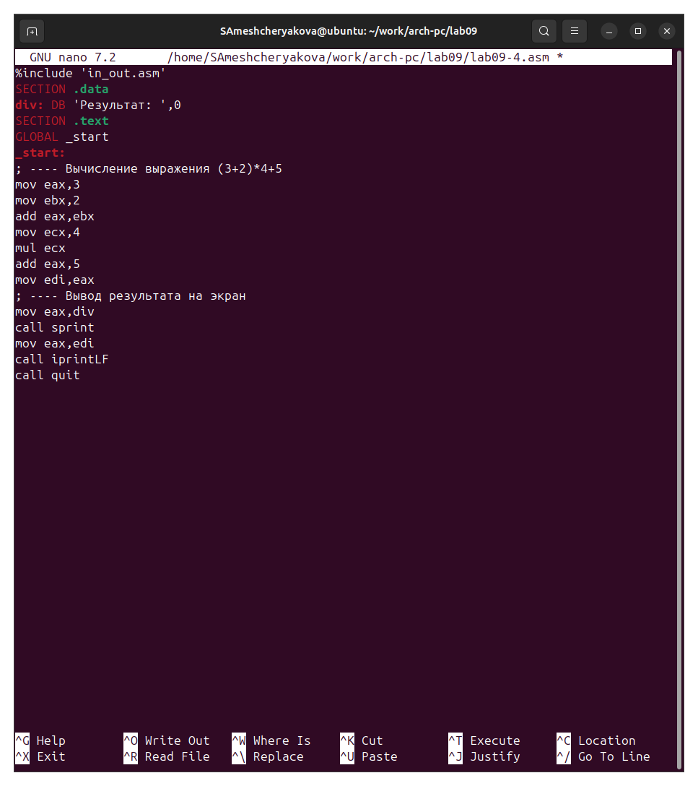{#fig-036 width=90%}

Создадим исполняемый файл и запустим его ([рис. @fig-037]).

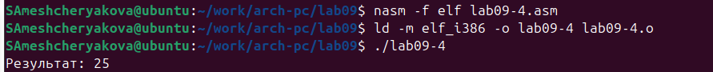{#fig-037 width=90%}

Теперь программа работает корректно.

# Выводы

Мы познакомились с методами отладки при помощи GDB и его возможностями, а также научились работать с подпрограммами.

