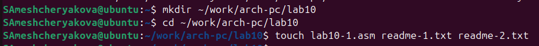
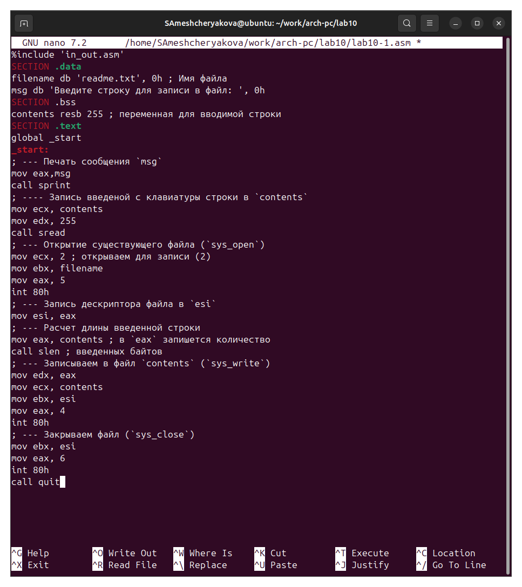
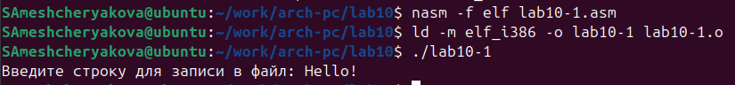
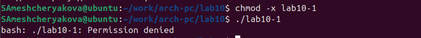
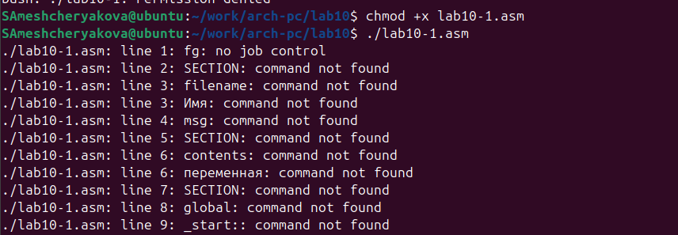
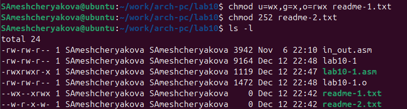
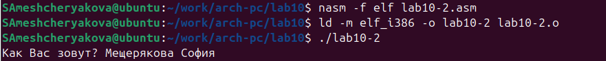
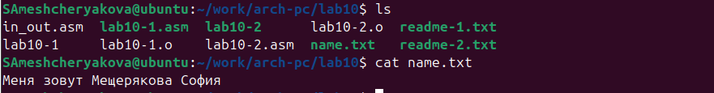

---
## Author
author:
  name: Мещерякова София Андреевна
  affiliation:
    - name: Российский университет дружбы народов
      country: Российская Федерация
      postal-code: 117198
      city: Москва
      address: ул. Миклухо-Маклая, д. 6

## Title
title: "Отчёт по лобораторной работе №10"
subtitle: "Работа с файлами средствами Nasm"
license: "CC BY"
--- 


# Цель работы

Приобретение навыков написания программ для работы с файлами.

# Выполнение лабораторной работы

Создаем каталог для лабораторной работы №10, и в нем создаем файлы ([рис. @fig-001]).

{#fig-001 width=90%}

Открываем файл и вводим программу из листинга 10.1 ([рис. @fig-002]).

{#fig-002 width=90%}

Создаем исполняемый файл и запускаем его ([рис. @fig-003]).

{#fig-003 width=90%}

Изменяем права доступа к файлу, запретив его выполнение. Пробуем запустить файл ([рис. @fig-002]).

{#fig-004 width=90%}

Выдало: отказано в доступе. Значит мы поставили правильный запрет на выполнение.

Изменяем права доступа к файлу с исходным текстом программы, добавив права на исполнение. Запускаем файл ([рис. @fig-005]).

{#fig-005 width=90%}

lab10-1.asm - файл с исходным кодом программы на языке ассемблера, искусственно добавление права на исполнение не даст ожидаемого результата.

Предоставляем права доступа к файлам (вариант 15) в символьном и двоичном виде и проверяем работу команд. ([рис. @fig-006]).

{#fig-006 width=90%}

## Задание для самостоятельной работы

Создаем новый файл ([рис. @fig-007]).

{#fig-007 width=90%}

Напишем программу, работающую по следующему алгоритму:

- Вывод приглашения “Как Вас зовут?”

- ввести с клавиатуры свои фамилию и имя

- создать файл с именем name.txt
 
- записать в файл сообщение “Меня зовут”

- дописать в файл строку введенную с клавиатуры

- закрыть файл

Текст программы:

``` nasm

%include 'in_out.asm'

SECTION .data
    msg: DB 'Как Вас зовут? ',0
    filename: DB 'name.txt',0
    message: DB 'Меня зовут ',0

SECTION .bss
    name: RESB 80

SECTION .text
    global _start
    _start:
        mov eax, msg
        call sprint
        mov ecx, name
        mov edx, 80
        call sread
        mov ecx, 0777o
        mov ebx, filename
        mov eax, 8
        int 80h
        mov esi, eax
        mov eax, message
        call slen
        mov edx, eax
        mov ecx, message
        mov ebx, esi
        mov eax, 4
        int 80h
        mov ebx, esi
        mov eax, 6
        int 80h
        mov ecx, 1
        mov ebx, filename
        mov eax, 5
        int 80h
        mov esi, eax
        mov edx, 2
        mov ecx, 0
        mov ebx, eax
        mov eax, 19
        int 80h
        mov eax, name
        call slen
        mov edx, eax
        mov ecx, name
        mov ebx, esi
        mov eax, 4
        int 80h
```

Создаем исполняемый файл и запускаем его ([рис. @fig-008]).

{#fig-008 width=90%}

Проверяем работу программы с помощью команд ls и cat ([рис. @fig-009]).

{#fig-009 width=90%}


# Выводы

Мы научились писать программы для работы с файлами и предоставлять права доступа к файлам.
